### SCENIC+ Workflow 

## Running 

```
snakemake --use-conda -j 1 -p \
    --resources mem_mb=256000 \
    --configfile Snakemake/config/config.yaml \
    --latency-wait 60

.snakemake/conda/
├── conda-abcdef123/   <- env for preprocessing.yml
├── conda-123456abc/   <- env for scenicplus.yml
├── conda-7890def456/   <- env for plotting.yml
├── conda-456def789/   <- env for some_other_rule.yml
├── conda-789abc012/   <- env for analysis_step2.yml
├── ...                <- env for visualization_extra.yml
├── ...
└── conda-zzz999xxx/   <- env for final_rule.yml

```

### SCENIC+ Major Steps

1. **Chromatin accessibility modeling (pycisTopic):**  
   - Perform topic modeling on scATAC-seq data to identify cis-regulatory topics (sets of co-accessible regions).

2. **cisTarget database creation:**  
   - Build motif/track databases from candidate regulatory regions.  
   - Databases are used to connect TF motifs with accessible regions.

3. **SCENIC+ analysis:**  
   - Integrate ATAC-seq (regulatory regions) with RNA-seq (gene expression).  
   - Infer TF–target gene regulons using motif enrichment + peak-to-gene links.  
   - Score regulon activity across single cells to characterize cell states.

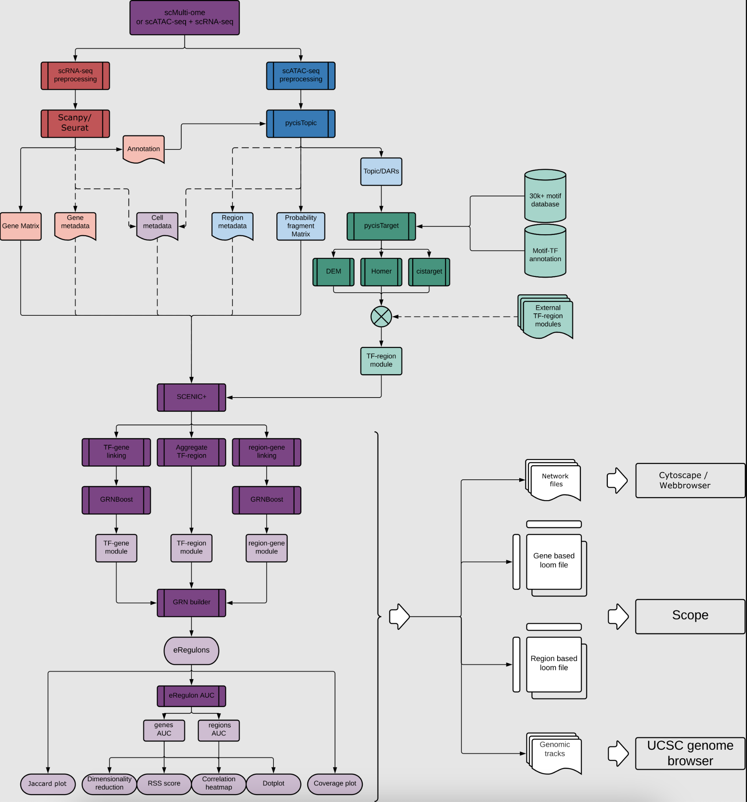


---
# 🛑 PART A: Preprocessing of scRNA
---

This step performs **cell-level preprocessing, dimensionality reduction, clustering, and visualization** for single-cell RNA-seq data.  

The goal is to **group similar cells together** based on their gene expression profiles and prepare the data for downstream analyses and interpretation.

1. **Defines cell types or states**
   - Clustering organizes cells based on similarity, providing a clear structure for interpretation.

2. **Supports downstream analyses**
   - Clusters and cell type labels can guide pseudobulk aggregation, marker gene evaluation, or further integrative analyses.

3. **Improves interpretability**
   - Visualization and marker gene plotting help assign biological meaning to clusters, making results easier to understand and communicate.


## Part A Results: scRNA-seq results    

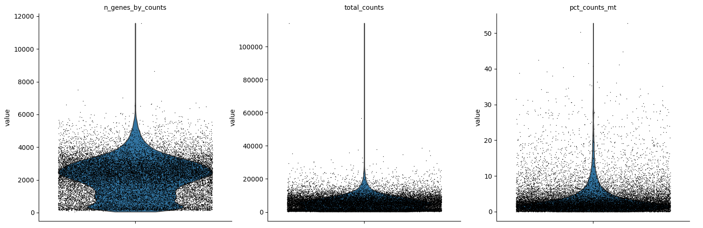
Violin plots displaying quality control metrics such as number of genes detected per cell, total counts, and percentage of mitochondrial gene expression.

### Filtering Criteria

Quality control filtering was applied to exclude low-quality cells and potential doublets. Cells were retained only if they met all the following conditions:

- Number of genes detected per cell between **500 and 7000**
- Total counts per cell between **1000 and 30,000**
- Percentage of mitochondrial gene counts less than **25%**

This filtering step ensures removal of dead or dying cells, doublets, and technical artifacts, thereby improving the quality of downstream analyses.


### Additional Analysis Figure
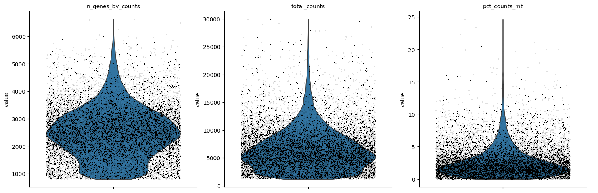

### UMAP and Clusters UMAP


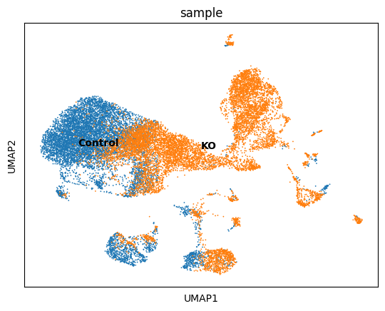


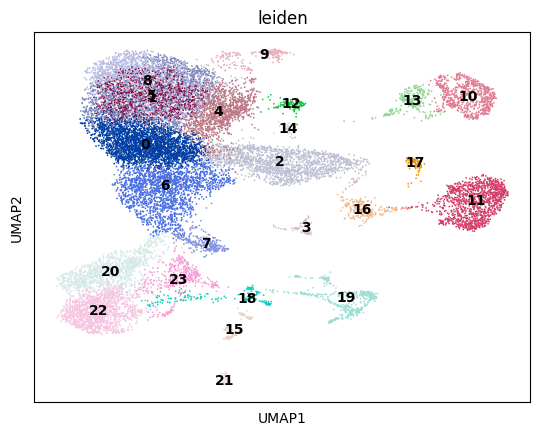

### DOTPLOT 


### Marker Genes UMAP


### Annotations 

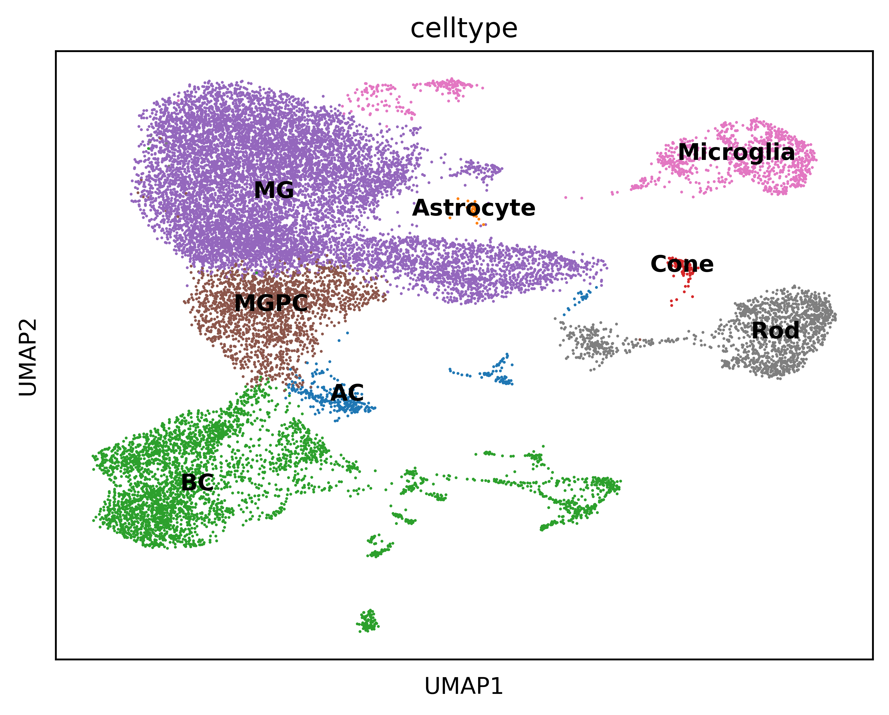

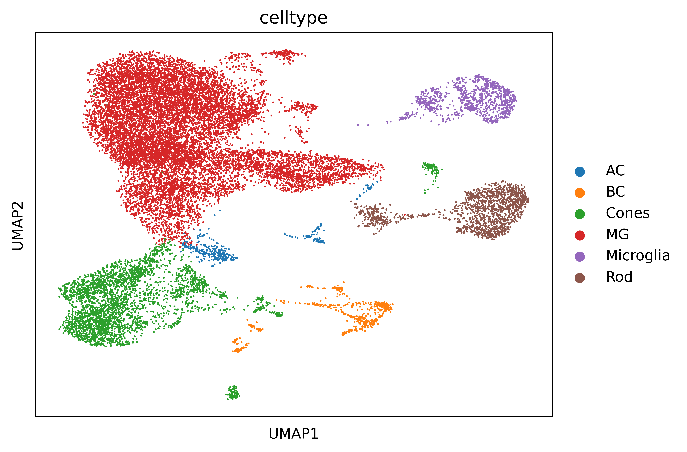

### Cell counts 

This is the cell counts in clusters based on barcodes:

| Cluster      | Cell Count |
|--------------|-----------|
| MG           | 3206      |
| BC           | 1298      |
| Rod          | 997       |
| MGPC         | 612       |
| Microglia    | 344       |
| AC           | 103       |
| Cone         | 48        |
| Astrocyte    | 4         |
|**Total cells** | **6612** |


---
# 🛑 PART B: Pycistopic
---


## scATAC pre-analysis by Seurat as input to pycistopic preprocessing 

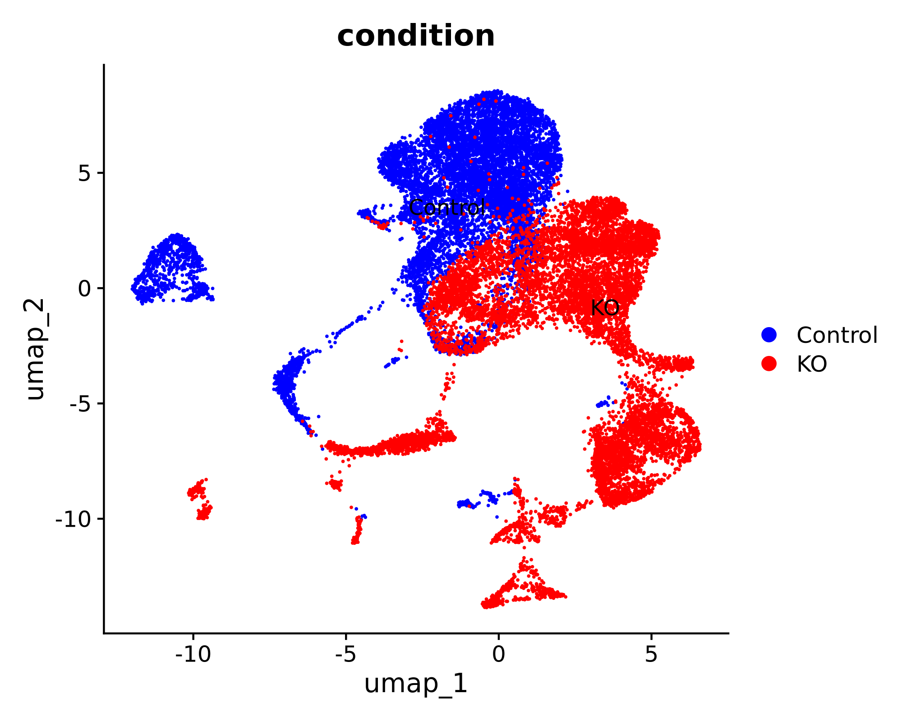

### Clustering 

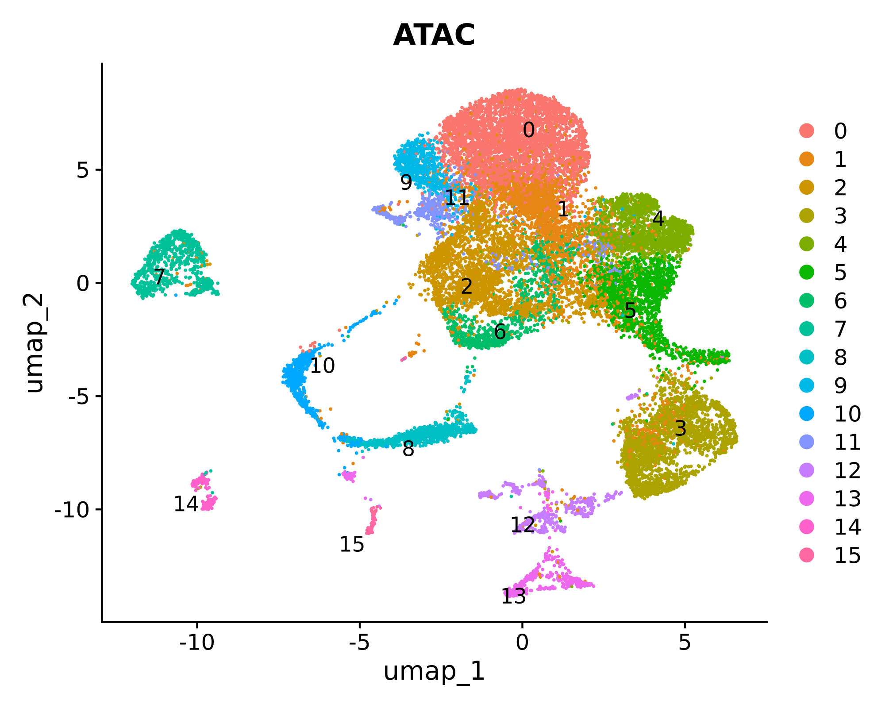

---

> ## 🔹 1. Pseudobulk Export with pycisTopic 

This step **executes the pseudobulk aggregation** using `pycisTopic`.  
- Takes the conceptual idea and TSV intermediates from Step 1 and **produces the actual BED/BigWig files** for downstream analysis.  
- Aggregates reads per **cell type × sample**, generating clean coverage tracks for visualization and peak calling.  


Total barcodes across all samples: 1156914
-----------------------
Sample distribution:
-----------------------
### 
| Sample   | Barcodes   |
|----------|------------|
| Control  | 584491     |
| KO       | 572423     |

and

```
scenicOuts/
└── consensus_peak_calling
    ├── bed_paths.tsv
    ├── bw_paths.tsv
    ├── pseudobulk_bed_files
    │   ├── Control.fragments.tsv.gz
    │   └── KO.fragments.tsv.gz
    └── pseudobulk_bw_files
        ├── Control.bw
        └── KO.bw
```


> ## 🔹 2. Peak Calling Step with MACS2


This step identifies **peaks**, i.e., genomic regions that are significantly enriched for ATAC-seq fragments.  

- Pseudobulk files summarize the signal for each **cell type × sample**.  
- MACS2 uses these aggregated fragment coordinates to detect regions with **high accessibility**, likely representing regulatory elements such as enhancers or promoters.  
- The output peaks are later used to generate **consensus peaks** and for topic modeling in pycisTopic.

Think of the pseudobulk BED as a **heat map of open windows across the city**.  
- MACS2 finds **clusters of “hot spots”** where many windows are open at once — these are your peaks.  
- Each peak represents a genomic region with strong evidence of accessibility in that cell type.


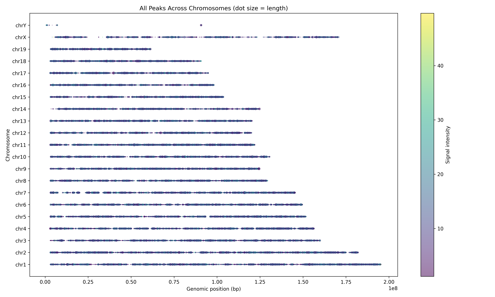  

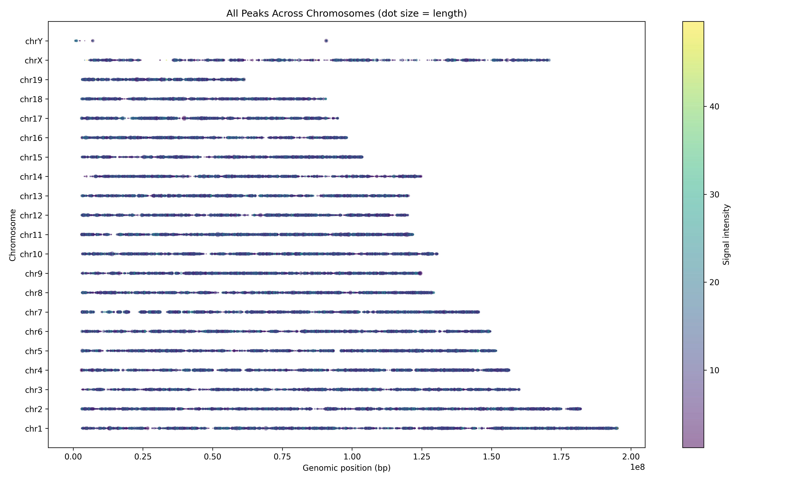


> ## 🔹 3. Consensus Peak Generation Step


After pseudobulk aggregation and MACS2 peak calling, each sample (or cell type × sample) has its **own set of peaks**.  
- Different samples may have slightly different peaks because of biological variability or sequencing depth.  
- To do comparative analyses across samples or feed data into pycisTopic, we need **one unified set of peaks** — the **consensus peak set**.  

Think of it as **finding all regions that are open in at least one sample and merging overlapping regions into a master list**.

Imagine several people drawing maps of the same city, each highlighting where the windows are open.  
- Each map may differ slightly.  
- The consensus peak step **merges all maps into one master map** that shows all open windows observed across everyone.  

---


> ## 🔹 4. TSS Generation Step in pycisTopic

This step generates a **BED file containing the transcription start sites (TSSs)** of genes for the reference genome.  

- TSS regions are important for **quality control**, such as checking **TSS enrichment** in ATAC-seq data.  
- It can also be used to **annotate peaks** with nearby genes for downstream analyses.  

> ## 🔹 5. QC check and plots 


### TH1
- Barcode QC  
  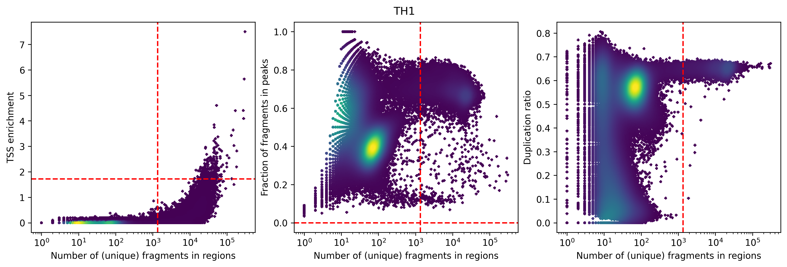

- General QC  
  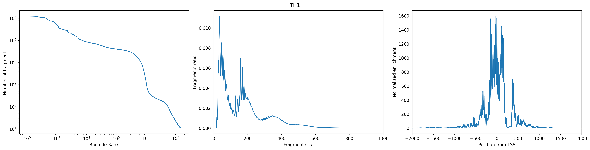

### TH2
- Barcode QC  
  

- General QC  
  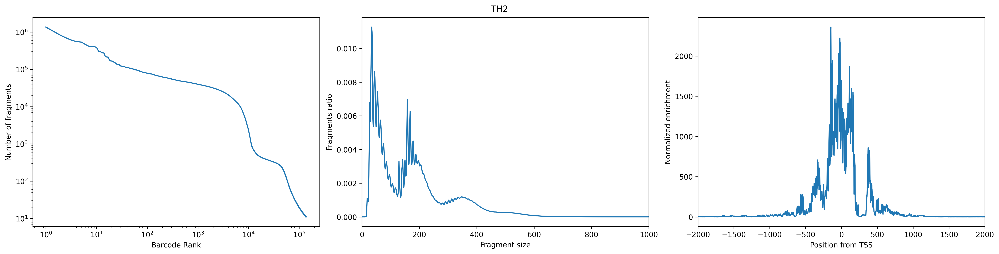

## Comments on graphs 

## Comments on Graphs

| Plot | What to Look For | Good | Bad/Warning |
|------|-----------------|------|-------------|
| **TSS enrichment vs. unique fragments** | Relationship between signal strength and barcode count | Top-right cluster: strong enrichment, many fragments | Bottom-left: few fragments + low enrichment. Cluster at low enrichment but high fragments = possible junk |
| **FRiP vs. unique fragments** | Fraction of reads in peaks | High FRiP + enough fragments = high quality | Low FRiP or too few fragments = noisy |
| **Duplication ratio vs. unique fragments** | PCR duplication | Moderate duplication with enough fragments = ok | High duplication (PCR artifacts) or odd low-frag barcodes = junk |
| **Barcode rank plot** | Knee shape | Plateau (left side) = real cells | Steep drop (right) = background |
| **Fragment size distribution** | ATAC periodicity | Peaks at <100bp and ~200/400bp (nucleosomes) = good | Flat/no periodicity = poor complexity |
| **TSS profile** | Enrichment around TSS | Strong peak centered at 0 = good | Flat = background noise |


> ## 🔹 6. Creating Cistopic Objects Step

This step creates a **cistopic object**, which is the central data structure used by pycisTopic for **topic modeling of chromatin accessibility**.  

- The cistopic object organizes **fragment data, peak regions, and QC information** in a way suitable for downstream analyses.  
- It is essentially a **single-cell peak-by-cell matrix** stored in a Python pickle file, with metadata attached.  
- This step is **critical** because it transforms raw and pseudobulk fragment data into a structured object suitable for all downstream pycisTopic analyses.

## 🧫 Sample Overview

| Sample | Cells | Regions | Project Name | Fragment File |
|--------|-------|---------|--------------|---------------|
| **TH1** | 294 cells | 163,474 regions | `TH1` | `TH1_atac_fragments.tsv.gz` |
| **TH2** | 258 cells | 163,375 regions | `TH2` | `TH2_atac_fragments.tsv.gz` |


> ## 🔹 7. Merging Cistopic Objects Step

This step merges **one or more cistopic objects** into a single unified object.  

- In workflows with multiple samples, batches, or preprocessing runs, each cistopic object may represent a separate sample or subset of cells.  
- Merging combines them into a **single cistopic object**, making downstream analyses (topic modeling, clustering, DAR analysis) easier and consistent across all cells.  

## Merged CistopicObject Summary

### 📊 Dataset Overview
- **Project**: TH1_TH2_merged
- **Total Cells**: 552 (294 TH1 + 258 TH2)
- **Total Regions**: 164,065
- **File Size**: 226,875.51 KB

### 🧫 Sample Integration
- **Fragments**: Both TH1 and TH2 fragment files integrated
- **Cell Data**: All 552 cells with complete QC metrics (23 columns)
- **Region Data**: Unified genomic regions from both samples


> ## 🔹 8. Adding scRNA-seq Metadata to Cistopic Objects

This step integrates **scRNA-seq-derived metadata** into the merged cistopic object.  

- Single-cell RNA-seq preprocessing (clustering, cell type annotation) provides **cell type labels, sample IDs, or other metadata**.  
- Attaching this information to the cistopic object allows **linking chromatin accessibility topics to known cell types** for interpretation.  


> ## 🔹 9. Topic Modeling with Mallet (run_mallet.py)

### 🧬 Latent Dirichlet Allocation (LDA) topic modeling/Mallet Example for Biologists

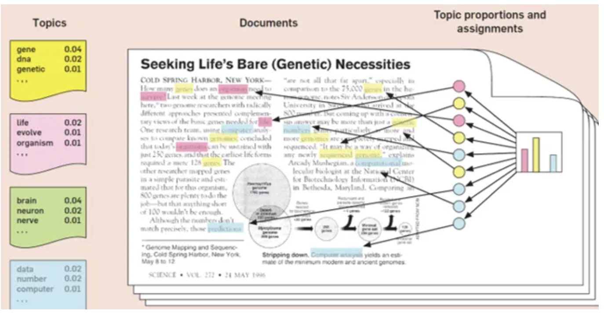
Source : Blei, D.M., 2012. Probabilistic topic models. Commun. ACM 55(4)

Think of **documents** (e.g., research articles) as mixtures of **topics** (e.g., "neurodevelopment", "immune response").  
Each **topic** is defined by a group of **words that tend to occur together** (e.g., *axon, neuron, synapse*).

Latent Dirichlet Allocation (LDA) topic modeling works in three main steps:

1. **Guessing topics**  
   - LDA scans across documents and looks for patterns of words that frequently co-occur.  

2. **Assigning words to topics**  
   - Each word in a document is (probabilistically) assigned to a topic.  
   - This assignment is refined repeatedly using *Gibbs sampling* (like shuffling topic labels until a stable pattern emerges).  

3. **Producing outputs**  
   - A list of topics = groups of words that often appear together.  
   - For each document = the proportion of topics it contains.  

👉 In short: **LDA discovers hidden themes in large text collections by grouping words that “like to appear together,” and shows how much each document is made of those themes.**

---

💡 **Note:** [MALLET](http://mallet.cs.umass.edu/) is a software package that provides an **efficient implementation of LDA**, making it faster and more scalable on large datasets.


### In GRN context 

### 🧩 What is a GRN Module?

In the context of gene regulatory networks (GRNs), a **module** is:

> A group of **genes and/or regulatory regions (peaks)** that are **co-regulated**, meaning they tend to be active together in the same cells.  
> Modules often correspond to the set of genes controlled by the same transcription factor or regulatory program.  

Modules help simplify complex GRNs by grouping together genes with coordinated activity, making it easier to understand regulatory patterns in single-cell data.

| NLP Concept      | GRN Concept (SCENIC+)       | What is counted (input to model)       | What LDA/MALLET infers                          |
| ---------------- | --------------------------- | -------------------------------------- | ------------------------------------------------ |
| Document         | Cell                        | Accessibility counts (peaks per cell) or expression counts (genes per cell) | Distribution of regulatory programs (topics) across the cell |
| Word             | Genomic region (peak) / Gene| How often a region is accessible in a cell (or gene is expressed) | Assignment of region/gene to one or more topics (modules) |
| Topic            | Regulatory module / Program | Groups of peaks or genes that co-occur across many cells | Which features form a coherent regulatory program |
| Topic proportion | Module activity in a cell   | Number of regions/genes linked to each topic in a cell | How strongly each regulatory program is active in that cell |


This step applies **Latent Dirichlet Allocation (LDA) topic modeling** to the chromatin accessibility data in the `cistopic` object.  

- **Topics = sets of genomic regions (peaks)** that show coordinated accessibility across cells.  
- By learning these topics, LDA reduces the **high-dimensional peak-by-cell matrix** into a smaller number of **regulatory accessibility patterns**, often reflecting transcription factor programs or cell type–specific regulation.  
- **MALLET** (a high-performance Java toolkit) provides a fast and scalable implementation of LDA, making it suitable for large single-cell ATAC-seq datasets.  
- Input: the annotated `cistopic` object containing the **peak-by-cell matrix** (from consensus peaks) and **cell metadata** (from scRNA-seq annotations).  
- Output: an interpretable, low-dimensional representation of accessibility that underlies downstream analyses such as clustering, differential accessibility (DARs), and gene regulatory network (GRN) inference.  


--- 
> ## 🔹 10. Adding LDA Model to Cistopic Object

**Input from Mallet:** A count matrix of genes/peaks per cell: each row = a cell, each column = a gene/peak, each entry = how often that gene/peak occurs (or is active) in that cell.

**Goal of LDA in SCENIC+:** Discover hidden regulatory structure in single-cell data.  
Input: Mallet counts of genes/peaks per cell.  
Output:
- 1) Modules = groups of co-occurring/co-regulated genes/peaks, 
- 2) Module activity per cell = how strongly each module is present in each cell. 
- LDA is essentially finding hidden patterns of co-regulation from the raw co-occurrence data prepared by Mallet.


> ## 🔹 11. Clustering Cistopic Objects and UMAP Visualization

This step performs **dimensionality reduction and clustering** of cells based on their **topic profiles**.  

- Each cell now has a **topic proportion vector** from the previous LDA step.  
- Clustering identifies groups of cells with similar chromatin accessibility patterns.  
- UMAP is used to **visualize the cells in 2D space** for exploratory analysis and interpretation.  
- **Takes the cistopic object with integrated LDA model** (topic distributions per cell).
- **Uses topic proportions** to construct a similarity graph for clustering.
- Prepares the object for **differential accessibility analysis, visualization, and interpretation**.

### Clustering output 

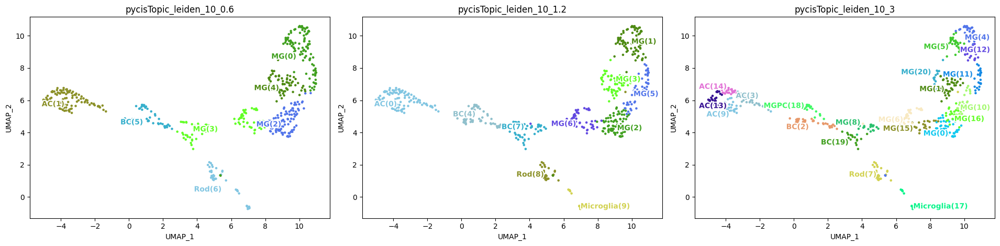
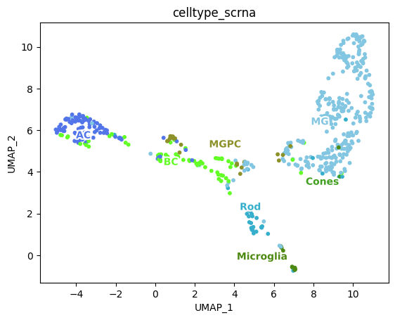

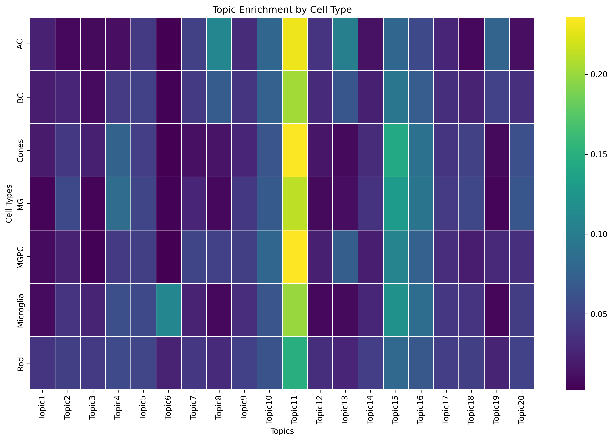


> ## 🔹 12. Binarizing Topics Step

This step **converts continuous topic distributions into binary accessibility matrices** for downstream analysis, such as differential accessibility testing (DAR).  

- Each cell has **topic proportions** from the LDA step.  
- Binarization transforms these proportions into **presence/absence calls**, e.g., a peak is considered "active" in a cell if its topic proportion passes a threshold.  
- This simplifies downstream analyses and makes them more robust to noise.

#### Binarisations output 

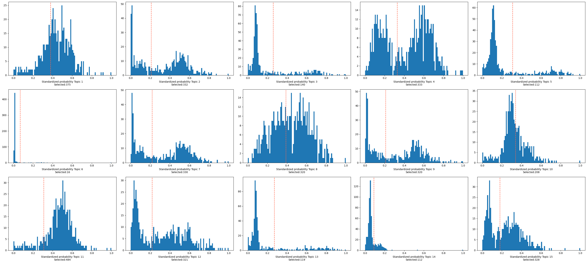  


#### What the plots show

- **Each subplot** = one topic (e.g., Topic 1, Topic 2, … Topic 20).  
- **X-axis** = standardized probability of that topic in a given cell (range: 0–1).  
  - Higher probability → stronger association of the cell with the topic.  
- **Y-axis** = number of cells with that probability.  
  - Each subplot is a histogram of topic activity across cells.  
- **Red dashed vertical line** = binarisation threshold.  
  - Cells **to the right** of the line are considered *selected* (active for that topic).  
  - Cells **to the left** are not.  
- **“Selected = N”** = how many cells passed the threshold for that topic.  

---

#### How to interpret the plots

- **Topics with sharp right tails** (e.g., Topic 1, 3, 6, 13, 18, 19):  
  - Most cells have low probabilities; only a subset passes the threshold.  
  - → These topics are active in **specific subsets of cells** (likely distinct cell states or regulatory programs).  

- **Topics with broad or bimodal distributions** (e.g., Topic 5, 9, 11, 15, 17):  
  - Many cells span medium to high probabilities.  
  - Threshold selects a large fraction of cells.  
  - → These topics may represent **widespread regulatory programs** across multiple cell types.  

- **Topics with flatter/noisy distributions** (e.g., Topic 7, 10, 14, 20):  
  - Fewer cells clearly pass the threshold.  
  - → These may be **weaker or less biologically meaningful topics**, or background noise.  

---


> ## 🔹 13.  Differential Accessibility (DAR) Analysis Step

This step identifies **differentially accessible regions (DARs)** between groups of cells, such as cell types or clusters.  

- Uses the **binarized cistopic object** from the previous step.  
- Tests which peaks are significantly more accessible in one group of cells versus others.  
- Results can reveal **cell type–specific regulatory regions** or other biologically meaningful patterns.  

#### DAR preliminary results


### Interpretation of DAR Mean–Dispersion Plot

* **Accessible regions:** The plot shows a large number of features, indicating plenty of accessible regions in the dataset.
* **Mean accessibility:** Most features have low mean accessibility (common in ATAC-seq), with some highly accessible peaks likely corresponding to promoters.
* **Dispersion:** A strong subset of features (yellow) are highly variable, suggesting good biological variability.
* **QC check:** The presence of many variable peaks (yellow) means the dataset has rich information for downstream DAR and regulatory network analysis.

✅ Overall: The data contain a healthy number of accessible and variable regions, suitable for SCENIC+ analysis.


## Number of DARs found using  --adjpval_thr 0.05 and  --log2fc_thr 0.5

| Cell type   | DARs   |
|-------------|--------|
| AC          | 37,753 |
| BC          | 33,504 |
| Cones       | 0      |
| MG          | 23,660 |
| MGPC        | 13,113 |
| Microglia   | 15,838 |
| Rod         | 27,449 |


> ## 🔹 14. Exporting Region Sets from DAR Results

This step exports **lists of genomic regions (peaks) identified as DARs** into separate files for downstream analyses or external tools.  

- Takes the **cistopic object annotated with DAR results** from the previous step.  
- Generates **BED or other standard formats** representing differentially accessible regions per group or cell type.  
- These exported region sets can be used for:
  - Motif enrichment analysis  
  - Gene set enrichment analysis  
  - Visualization in genome browsers  

---
# 🛑 PART C: cisTarget Databases
---

This step involves **using cisTarget databases** for motif and regulatory network analysis downstream of pycisTopic.  

- cisTarget databases link **genomic regions (peaks) to transcription factor motifs** and candidate target genes.  
- They are required for **motif enrichment analysis, regulatory network inference, and linking DARs to TF activity**.  
- **Creating custom cisTarget databases is optional**, but can be done if you want to analyze a specific genome, species, or motif collection.  
- For speed and convenience, we will **rely on prebuilt databases** in this workflow.


## Prebuilt Databases

For mouse (`mm10`) or human (`hg38`), prebuilt cisTarget databases typically include:

1. **Motif rankings (`.feather` files)**  
   - Stores **motif–region scores** → tells how well each motif matches each genomic region.  

### Example from `mm10_screen_v10_clust.regions_vs_motifs.rankings.feather`

| chr10:100001588-100001754 | chr10:100004590-100004749 | chr10:100009729-100010013 | ... | chrY:9986285-9986625 | chrY:9992323-9992533 | motifs          |
|----------------------------|---------------------------|---------------------------|-----|----------------------|----------------------|-----------------|
| 635378                     | 961923                    | 81883                     | ... | 261962               | 1096188              | bergman__Su_H_  |
| 294685                     | 79408                     | 809215                    | ... | 108758               | 747006               | bergman__croc   |
| 772320                     | 771634                    | 289363                    | ... | 430798               | 855092               | bergman__pho    |
| 577456                     | 435983                    | 23497                     | ... | 682309               | 706782               | bergman__tll    |
| 976643                     | 795153                    | 810566                    | ... | 3809                 | 1018969              | c2h2_zfs__M0369 |

**Table dimensions:** 5032 motifs × 1,110,656 genomic regions  

👉 **Motif matching a region = the region’s DNA sequence looks like a potential binding site for the TF that recognizes that motif.**

2. **Motif annotations (`.motifs.tbl`)**  
   - Provides **motif annotations** → maps motifs to their likely TF(s), related motifs, and orthologs.  

### Example from `motifs-v10nr_clust-nr.mgi-m0.001-o0.0.tbl`
 
| motif_id         | motif_name | gene_name | motif_similarity_qvalue | similar_motif_id | orthologous_identity |
| ---------------- | ---------- | --------- | ----------------------- | ---------------- | -------------------- |
| metacluster_196.3| EcR_usp    | Hnf4a     | 0                       | None             | 0.265823             |
| metacluster_196.3| EcR_usp    | Nr1h4     | 1.04865e-07             | metacluster_64.14| 0.539514             |
| metacluster_196.3| EcR_usp    | Nr2f1     | 8.38436e-08             | metacluster_64.14| 0.995238             |

**Notes:**  
- `motif_similarity_qvalue` = statistical score (FDR-adjusted p-value). Smaller values mean stronger similarity between motifs.  
- `similar_motif_id` = the motif cluster this motif is most similar to.  
- `orthologous_identity` = percent sequence identity between the TF gene in your species and an orthologous TF from another species.  

---

## Role in Workflow

- cisTarget databases are used **after DARs or topic regions are identified**.  
- They allow pycisTopic to perform:

  1. **Motif enrichment analysis**  
     - Determine which TF motifs are overrepresented in DARs or topic-specific peaks.  
  2. **Regulatory network inference**  
     - Identify candidate TFs controlling cell type–specific chromatin accessibility.  

- Without these databases, the downstream steps (cisTarget enrichment) cannot run efficiently.  

---

## Using Prebuilt vs Custom Databases

- **Prebuilt databases (recommended):**  
  - Saves time, standardized, widely used, compatible with pycisTopic.  
- **Custom databases (optional):**  
  - Can be created if you need specific motifs, a custom genome build, or updated annotations.  
  - Takes longer but provides maximum flexibility.

---
# 🛑 PART D: Running Scenic+ workflow step 
---

- The Snakemake workflow runs the SCENIC+ pipeline on your processed ATAC (and optional scRNA) data.  
- Its main goal is to **infer gene regulatory networks (GRNs)** and compute **TF activity scores per cell**.

SCENIC+ builds on the outputs of **pycistopic** and **cistarget** to generate gene regulatory networks (GRNs).

----

> **Outputs**  
>  
> 1. **Gene Regulatory Network (GRN)**  
>    - TFs linked to predicted target genes  
>    - Derived from DARs/topics and motif enrichment  
>  
> 2. **TF Activity Matrices**  
>    - Quantitative scores of TF activity per cell  
>  
> 3. **Regulatory Modules**  
>    - Groups of genes predicted to be co-regulated by each TF  
>  
> 4. **Plots and Visualizations**  
>    - Heatmaps of TF activity  
>    - Network diagrams of GRNs  
>    - Motif enrichment summaries  

----

### What SCENIC+ does

SCENIC+ takes chromatin accessibility data (and optionally RNA data) and integrates cisTarget motif enrichment to build and score regulatory networks.  

👉 In short:
SCENIC+ moves from **chromatin accessibility → motif enrichment → region-to-gene linking → TF activity per cell**, providing a powerful way to dissect cell-type–specific gene regulation.
---

#### 1. Prepare Input Matrices
- Start from a **cisTopic object** (peak × cell accessibility matrix or topic binarization).  
- Collect **cell metadata** such as clusters, cell types, or matched scRNA-seq expression.

---

#### 2. Motif Enrichment (cisTarget step)
- For each set of regions (e.g. DARs or topic-specific peaks), identify enriched transcription factor motifs using **prebuilt cisTarget databases** (`.feather` + `.tbl`).  
- This reveals which TFs are likely associated with those accessible regions.

---

#### 3. Link Regions to Genes
- Connect enriched regions to their nearby or correlated genes (using genomic proximity or co-variation with RNA).  
- Produces **region–gene relationships**.

---

#### 4. Build Regulatory Networks
- Combine **TF–region links** (from motif enrichment) with **region–gene links**.  
- Result: TF → region → gene connections, i.e. a **Gene Regulatory Network (GRN)**.  
- Optionally integrate **scRNA-seq expression** to refine TF–target predictions.

---

#### 5. Score TF Activity Per Cell
- Evaluate the accessibility of each TF’s target regions per cell.  
- Produces a **cell × TF activity matrix** (similar to regulon activity in SCENIC).  
- Allows clustering and visualization of regulatory programs across cell states.

---

#### 6. Visualization & Modules
- Summarize TF–target relationships into **regulatory modules** (groups of co-regulated genes).  
- Generate plots:  
  - Heatmaps of TF activity  
  - Motif enrichment plots  
  - Network diagrams of TFs and targets  

---

## Part D results: scenic+

### Motif Enrichment in SCENIC+

#### 1. Where do the motif enrichment results come from?

The motif enrichment results ([`dem_results.html`](Snakemake/workflow/dem_results.html)) and `dem_results.hdf5` are generated from the **ATAC-seq modality**:

- Peaks/DARs are identified from ATAC (cisTopic + DAR analysis).
- SCENIC+ then tests for **differential motif enrichment (DEM)** in those regions.
- This step checks whether certain TF motifs are significantly enriched in accessible regions linked to specific topics, clusters, or conditions.

➡️ In short: **DEM is ATAC-driven**, but the motifs are mapped back to transcription factors (TFs).

---

#### 2. Why are motif enrichment results needed downstream?

The overall goal of SCENIC+ is to reconstruct **gene regulatory networks (GRNs)** that are supported by both chromatin accessibility and gene expression.  
The motif enrichment layer plays several critical roles:

- **TF prioritization**  
  - Many peaks can map to multiple TFs.  
  - Motif enrichment highlights which TFs are most likely active in a given state.

- **Connecting ATAC to GEX**  
  - Later steps integrate motif enrichment (from ATAC) with co-expression (from RNA).  
  - This is how SCENIC+ builds *regulons* (TF → target gene sets).

- **Filtering false positives**  
  - Expression correlations alone can give spurious TF–gene links.  
  - Motif support ensures that inferred connections have chromatin evidence.

- **Interpreting biology**  
  - Differential motif activity per topic/cluster helps explain which TFs are driving specific cell states.

---

✅ The **DEM results act as a bridge** between ATAC and RNA modalities.  
They make sure that downstream TF–target links are not just statistically correlated, but also **biologically plausible**.

🚨🚨🚨🚨🚨 
##### SNAKEMAKE is still running, more rules are under execution and in the way 


## References

- [Pycistopic: Human Cerebellum Notebook](https://pycistopic.readthedocs.io/en/latest/notebooks/human_cerebellum.html#Getting-pseudobulk-profiles-from-cell-annotations)
- [SCENIC+: Official Documentation](https://scenicplus.readthedocs.io/en/latest/index.html)


