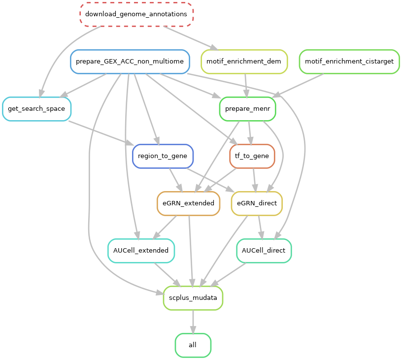

> # A walk through Scenic+ workflow: Gene Regulatory Network (GRN) Inference

#### ⚠️ Disclaimer: We will connect the pieces of the workflow, no optimization yet

### 🧠 Gene Regulatory Network (GRN) and Regulons

A **Gene Regulatory Network (GRN)** represents the regulatory relationships between **transcription factors (TFs)** and their **target genes**, describing how TFs can potentially control gene activity 

Within this network, a **regulon** is a functional unit consisting of a *TF and the set of genes it directly regulates*.  
In SCENIC+, regulons are identified and their activity is quantified across cells to reveal which regulatory programs are active in different cell states.

#### We will connect the pieces of the workflow, no optimization yet
  
## Workflow -- Step A-Z conda envs  

```
snakemake --use-conda -j 1 -p \
    --resources mem_mb=256000 \
    --configfile Snakemake/config/config.yaml \
    --latency-wait 60

.snakemake/conda/
├── conda-abcdef123/   <-  env1.yml env for step1,2, and 3 
├── conda-123456abc/   <-  env2.yml env for step4,5, and 6 
├── conda-7890def456/   <- env for plotting.yml
├── conda-456def789/   <- env for some_other_rule.yml
├── conda-789abc012/   <- env for analysis_step2.yml
├── ...                <- env for visualization_extra.yml
├── ...
└── conda-zzz999xxx/   <- env for final_rule.yml

```

## 🔹 What SCENIC+ does

SCENIC+ is a workflow for inferring gene regulatory networks from single-cell multi-omics data, particularly scATAC-seq and multiome. It integrates chromatin accessibility with transcription factor motif analysis and gene expression information to identify *regulons* (transcription factors and their target genes). By combining topic modeling of accessibility profiles with motif enrichment and gene linkage, SCENIC+ maps regulatory programs to specific cell types and states, enabling the discovery of cell-type–specific transcriptional control.


> ### 🔹 Chromatin accessibility modeling (pycisTopic)
> - Perform topic modeling on scATAC-seq data to identify cis-regulatory topics (sets of co-accessible regions).
>
> ### 🔹 cisTarget database creation
> - Build motif/track databases from candidate regulatory regions.
> - Databases are used to connect TF motifs with accessible regions.
>
> ### 🔹 SCENIC+ analysis
> - Integrate ATAC-seq (regulatory regions) with RNA-seq (gene expression).
> - Infer TF–target gene regulons using motif enrichment + peak-to-gene links.
> - Score regulon activity across single cells to characterize cell states.


---
# 🛑 PART A: Preprocessing of scRNA and scATAC
---

This step performs **cell-level preprocessing, dimensionality reduction, clustering, and visualization** for single-cell RNA-seq data.  

 
### 🔹 Role of scRNA-seq in SCENIC+

- **Linking regions to genes**  
  Uses gene expression to correlate accessible regions (from scATAC) with nearby genes, helping identify which open regions actually regulate those genes.
  And here we mean accessible regions are likely associated with gene activation not just close by the genome.

- **Scoring and validating regulatory modules**  
  Tests TF → region → gene modules against expression patterns — co-expressed target genes strengthen the TF–gene link.

- **Quantifying regulon activity per cell**  
  Computes regulon activity scores for each cell based on gene expression, enabling comparison across cell types or clusters to interpret biological function.


## Part A Results: scRNA-seq results    


Violin plots displaying quality control metrics such as number of genes detected per cell, total counts, and percentage of mitochondrial gene expression.

### Filtering Criteria

Quality control filtering was applied to exclude low-quality cells and potential doublets. Cells were retained only if they met all the following conditions:

- Number of genes detected per cell between **500 and 7000**
- Total counts per cell between **1000 and 30,000**
- Percentage of mitochondrial gene counts less than **25%**

This filtering step ensures removal of dead or dying cells, doublets, and technical artifacts, thereby improving the quality of downstream analyses.


### Additional Analysis Figure


##  scRNA annotations: to use a h5ad accepted by scenic+ 


### DOTPLOT 


### Marker Genes UMAP


### Annotations 


##### 🧬 Cell Counts per Type a
| Cell Type   | Count |
|-------------|--------|
| MG          | 10043  |
| BC          | 3681   |
| MGPC        | 1662   |
| Rod         | 1385   |
| Microglia   | 1189   |
| AC          | 571    |
| Cones       | 95     |


##### 🧬 Cell Counts per Typpe and Sample 

| Cell Type   | Control Count | OX Count |
|-------------|---------------|----------|
| MGPC        | 8             | 1654     |
| AC          | 27            | 544      |
| BC          | 132           | 3549     |
| Cones       | 13            | 82       |
| MG          | 7419          | 2624     |
| Microglia   | 957           | 232      |
| Rod         | 505           | 880      |


## scATAC preprocessing 


### Clustering 


---
# 🛑 PART B: Pycistopic
---


> ## 🔹 1. Pseudobulk Export with pycisTopic 

### 🔹 Initial Pseudobulk Aggregation (from fragments)

This step **combines raw ATAC-seq fragments into cell type–specific coverage tracks**:

- Reads from the **fragment files** of each sample are summed across all cells **.  
- Generates **BED/BigWig tracks** that capture chromatin accessibility at a summarized level.  

It uses `pycistopic_pseudobulk.py`

Total barcodes across all samples: 1156914
-----------------------
Sample distribution:
-----------------------
### 
| Sample   | Barcodes   |
|----------|------------|
| Control  | 584491     |
| KO       | 572423     |

and

```
scenicResults200/
└── consensus_peak_calling
    ├── bed_paths.tsv
    ├── bw_paths.tsv
    ├── pseudobulk_bed_files
    │   ├── Control.fragments.tsv.gz
    │   └── KO.fragments.tsv.gz
    └── pseudobulk_bw_files
        ├── Control.bw
        └── KO.bw
```
### A snapshot of the bigwig file 

##### Chr1 [--start 97,710,985 --end 97,760,985 ]


##### Chr19 


> ## 🔹 2. Peak Calling Step with MACS2


This step identifies **peaks**, i.e., genomic regions that are significantly enriched for ATAC-seq fragments.  

- **Pseudobulk files** summarize chromatin accessibility for each **cell type × sample**.  
- **MACS2** runs **separately for each pseudobulk**, detecting regions with high accessibility that likely correspond to **regulatory elements** (enhancers or promoters).  
- The resulting **peak files (per sample)** are later combined to generate a **consensus peak set**, used for **topic modeling** in *pycisTopic*.

###### Control Peaks 
  
###### KO Peaks


> ## 🔹 3. Consensus Peak Generation Step

- Peaks from all samples are merged to form a **unified peak set** representing all accessible regions.
- Any region open in **at least one sample** is included, ensuring no regulatory element is missed.
- Overlapping peaks are resolved by:
  - Keeping the original peak if only one overlaps,
  - Selecting the peak with the highest score if two overlap,
  - Choosing the most significant peak and removing overlapping others if three or more overlap.
- This creates a **shared reference space** (same peak coordinates across samples) for downstream analyses like LDA and accessibility matrices.
- Later steps identify which peaks are condition-specific or shared across samples.

---


> ## 🔹 4. TSS Generation Step in pycisTopic

This step generates a **BED file containing the transcription start sites (TSSs)** of genes for the reference genome.  

- TSS regions are important for **quality control**, such as checking **TSS enrichment** in ATAC-seq data.  
- It can also be used to **annotate peaks** with nearby genes for downstream analyses.  

> ## 🔹 5. QC check and plots 

```
python collect_qc_barcodes.py \
    --fragments_dict scenicResults200/fragments_dict.pkl \
    --qc_output_dir scenicResults200/QC \
    --output_pickle scenicResults200/QC/qc_barcodes_thresholds.pkl \
    --unique_fragments_threshold 200 \
    --tss_enrichment_threshold 0.1 \
    --frip_threshold 0
```

### TH1
- Barcode QC  
  

- General QC  
  

### TH2
- Barcode QC  
  

- General QC  
  

## Comments on Graphs

| Plot | What to Look For | Good | Bad/Warning |
|------|-----------------|------|-------------|
| **TSS enrichment vs. unique fragments** | Relationship between signal strength and barcode count | Top-right cluster: strong enrichment, many fragments | Bottom-left: few fragments + low enrichment. Cluster at low enrichment but high fragments = possible junk |
| **FRiP vs. unique fragments** | Fraction of reads in peaks | High FRiP + enough fragments = high quality | Low FRiP or too few fragments = noisy |
| **Duplication ratio vs. unique fragments** | PCR duplication | Moderate duplication with enough fragments = ok | High duplication (PCR artifacts) or odd low-frag barcodes = junk |
| **Barcode rank plot** | Knee shape | Plateau (left side) = real cells | Steep drop (right) = background |
| **Fragment size distribution** | ATAC periodicity | Peaks at <100bp and ~200/400bp (nucleosomes) = good | Flat/no periodicity = poor complexity |
| **TSS profile** | Enrichment around TSS | Strong peak centered at 0 = good | Flat = background noise |


- A high number of fragments with a low fraction in peaks suggests that fragments are spread across large regions but aren't associated with meaningful or enriched features, indicating less informative data.
- High duplication ratios indicate that many fragments are duplicates, likely due to technical biases like PCR duplication, making the data less informative as they don't provide unique information.
- Before the Knee: The curve shows a sharp decline, indicating high-quality, informative barcodes with more unique and meaningful data.
- After the Knee: The curve flattens or drops sharply, suggesting low-quality data or background noise (e.g., technical artifacts, duplicates, low-coverage barcodes).

###### How PycisTopic Calculates the `unique_fragments_threshold`

- PycisTopic determines the `unique_fragments_threshold` **per sample** based on the distribution of fragments per barcode.
- The process roughly works as follows:
  1. **Count unique fragments per barcode:** For each barcode in the ATAC-seq fragment file, count the number of distinct fragments mapped to the genome.
  2. **Estimate a quality threshold:** Using the distribution of fragment counts, PycisTopic selects a threshold to filter out low-quality barcodes (likely empty droplets or background).
     - This can be percentile-based or use heuristics on the fragment count distribution.
  3. **Apply the threshold:** Barcodes with **unique fragments below this value** are removed from the dataset.


> ## 🔹 6. Creating Cistopic Objects Step

This step creates a **cistopic object**, which is the central data structure used by pycisTopic for **topic modeling of chromatin accessibility**.  

- The cistopic object organizes **fragment data, peak regions, and QC information** in a way suitable for downstream analyses.  
- It is essentially a **single-cell peak-by-cell matrix** stored in a Python pickle file, with metadata attached.  
- This step is **critical** because it transforms raw and pseudobulk fragment data into a structured object suitable for all downstream pycisTopic analyses.


> ## 🔹 7. Merging Cistopic Objects Step

This step merges **one or more cistopic objects** into a single unified object.  

- In workflows with multiple samples, batches, or preprocessing runs, each cistopic object may represent a separate sample or subset of cells.  
- Merging combines them into a **single cistopic object**, making downstream analyses (topic modeling, clustering, DAR analysis) easier and consistent across all cells.  


#### 📊 Sample Overview

- **Sample 1**: 7,517 cells  
- **Sample 2**: 7,675 cells  

#### 📋 Summary Statistics

- **Total number of cells**: 15,192  
- **Total number of regions**: 164,077


> ## 🔹 8. Adding scRNA-seq Metadata to Cistopic Objects

This step integrates **scRNA-seq-derived metadata** into the merged cistopic object.  

- Single-cell RNA-seq preprocessing (clustering, cell type annotation) provides **cell type labels, sample IDs, or other metadata**.  
- Attaching this information to the cistopic object allows **linking chromatin accessibility topics to known cell types** for interpretation.  

#### After merging 

#### 📊 Sample Overview

- **Sample 1**: 6,537 cells  
- **Sample 2**: 6,542 cells  

#### 📋 Summary Statistics

- **Total number of cells**: 13,079 (86.05% match) 
- **Total number of regions**: 164,077


> ## 🔹 9. Topic Modeling with Mallet (run_mallet.py)

### 🧬 Latent Dirichlet Allocation (LDA) topic modeling/Mallet Example for Biologists


Source : Blei, D.M., 2012. Probabilistic topic models. Commun. ACM 55(4)

Think of **documents** (e.g., research articles) as mixtures of **topics** (e.g., "neurodevelopment", "immune response").  
Each **topic** is defined by a group of **words that tend to occur together** (e.g., *axon, neuron, synapse*).

> ### 🔹 Latent Dirichlet Allocation (LDA) Topic Modeling
>
> 1. **🕵️ Guessing topics**  
>    - LDA scans across documents to find patterns of words that frequently co-occur.
>
> 2. **📝 Assigning words to topics**  
>    - Each word in a document is probabilistically assigned to a topic.  
>    - Assignments are refined using *Gibbs sampling* (shuffling topic labels until a stable pattern emerges).
>
> 3. **📊 Producing outputs**  
>    - A list of topics: groups of words that often appear together.  
>    - For each document: the proportion of topics it contains.

👉 In short: **LDA discovers hidden themes in large text collections by grouping words that “like to appear together,” and shows how much each document is made of those themes.**

---

### In GRN context 

```
> 🧩 `What is a GRN Module`
> A group of **genes and/or regulatory regions (peaks)** that are **co-regulated**, 
  meaning they tend to be active together in the same cells.  
> Modules often correspond to the set of genes controlled by 
  the same transcription factor or regulatory program.  
```

Modules help simplify complex GRNs by grouping together genes with coordinated activity, making it easier to understand regulatory patterns in single-cell data.

| NLP Concept      | GRN Concept (SCENIC+)       | What is counted (input to model)       | What LDA/MALLET infers                          |
| ---------------- | --------------------------- | -------------------------------------- | ------------------------------------------------ |
| Document         | Cell                        | Accessibility counts (peaks per cell) or expression counts (genes per cell) | Distribution of regulatory programs (topics) across the cell |
| Word             | Genomic region (peak) / Gene| How often a region is accessible in a cell (or gene is expressed) | Assignment of region/gene to one or more topics (modules) |
| Topic            | Regulatory module / Program | Groups of peaks or genes that co-occur across many cells | Which features form a coherent regulatory program |
| Topic proportion | Module activity in a cell   | Number of regions/genes linked to each topic in a cell | How strongly each regulatory program is active in that cell |

> 💡 **Note:** [MALLET](http://mallet.cs.umass.edu/) is a software package that provides an **efficient implementation of LDA**, making it faster and more scalable on large datasets.


``` 
python run_mallet.py \
  --cistopic_obj_pickle scenicResults200/merged_with_meta.pkl \
  --mallet_path /nfs/turbo/umms-thahoang/sherine/tools/Mallet-202108/bin/mallet \
  --n_topics 5 15 25 45 55 \
  --n_cpu 12 \
  --n_iter 500 \
  --tmp_path scenicResults200/TMP \
  --save_path scenicResults200/MALLET \
  --mallet_memory 300G \
  --random_state 555 \
  --alpha 1 \
  --alpha_by_topic \
  --eta 0.1 \
  --eta_by_topic
``` 

--- 
> ## 🔹 10. Adding LDA Model to Cistopic Object

LDA finds **patterns of coordinated accessibility** across cells:
- **Topics** represent groups of genomic regions (peaks) that open/close together.
- Each “topic” = one module of co-accessible peaks.
- For each cell, LDA measures the activity of each module.
  i.e. how much the cell shows the pattern of that module  

> ## 🔹 11. Clustering Cistopic Objects and UMAP Visualization

This step performs **dimensionality reduction and clustering** of cells based on their **topic profiles**.  

- Each cell now has a **topic proportion vector** from the previous LDA step.  
- Clustering identifies groups of cells with similar chromatin accessibZZility patterns.  

### Clustering output 

###### Cell-based level 


 
 


> ## 🔹 12. Binarizing Topics Step

This step **converts continuous topic distributions into binary accessibility matrices** for downstream analysis, such as differential accessibility testing (DAR).  

- Each cell has **topic proportions** from the LDA step.  
- Binarization transforms these proportions into **presence/absence calls**, e.g., a peak is considered "active" in a cell if its topic proportion passes a threshold.  
- This simplifies downstream analyses and makes them more robust to noise.

#### Binarisations output 


#### What the plots show

- **Each subplot** = one topic (e.g., Topic 1, Topic 2, … Topic 20).  
- **X-axis** = standardized probability of that topic in a given cell (range: 0–1).  
  - Higher probability → stronger association of the cell with the topic.  
- **Y-axis** = number of cells with that probability.  
  - Each subplot is a histogram of topic activity across cells.  
- **Red dashed vertical line** = binarisation threshold.  
  - Cells **to the right** of the line are considered *selected* (active for that topic).  
  - Cells **to the left** are not.  
- **“Selected = N”** = how many cells passed the threshold for that topic.  

---

#### How to interpret the plots

- **Topics with sharp right tails** (e.g., Topic 16):  
  - Most cells have low probabilities; only a subset passes the threshold.  
  - → These topics are active in **specific subsets of cells** (likely distinct cell states or regulatory programs).  

- **Topics with broad or bimodal distributions** (e.g., Topic 2):  
  - Many cells span medium to high probabilities.  
  - Threshold selects a large fraction of cells.  
  - → These topics may represent **widespread regulatory programs** across multiple cell types.  

- **Topics with flatter/noisy distributions** (e.g., Topic 12):  
  - Fewer cells clearly pass the threshold.  
  - → These may be **weaker or less biologically meaningful topics**, or background noise.  

---

> ## 🔹 13.  Differential Accessibility (DAR) Analysis 

In this step, we try to find regions of the genome that are more accessible (open) in one group of cells compared to another. This helps us understand what makes different cell types or clusters unique.

- **Input:** We use a **binarized cistopic object** from the previous step (data that tells us which regions of the genome are open or closed in each cell).
  
- **Analysis:** We compare the accessibility of **genomic peaks** (regions) across different cell groups. The goal is to identify which peaks are more open in one group compared to another.

- **Output:** The results show which **genomic regions** are specific to certain cell types or groups, helping us uncover important biological differences between cells.

**Why it's different:** Unlike the previous step, which identifies general co-accessibility patterns across all cells, this step specifically compares accessibility across **different cell groups** to find regions that are uniquely accessible in one group versus others.


#### DAR preliminary results

- Number of highly variable regions: 75581 


### Interpretation of DAR Mean–Dispersion Plot

* **Accessible regions:** The plot shows a large number of features, indicating plenty of accessible regions in the dataset.
* **Mean accessibility:** Most features have low mean accessibility (common in ATAC-seq), with some highly accessible peaks likely corresponding to promoters.
* **Dispersion:** A strong subset of features (yellow) are highly variable, suggesting good biological variability.
* **QC check:** The presence of many variable peaks (yellow) means the dataset has rich information for downstream DAR and regulatory network analysis.

✅ Overall: The data contain a healthy number of accessible and variable regions, suitable for SCENIC+ analysis.

## Number of DARs found using  --adjpval_thr 0.05 and  --log2fc_thr 0.5

## Number of DARs found

| Cell Type   | DARs Found |
|-------------|------------|
| MGPC        | 8,535      |
| AC          | 14,986     |
| BC          | 35,141     |
| Cones       | 28,307     |
| MG          | 19,906     |
| Microglia   | 18,403     |
| Rod         | 21,095     |


##### OLD results under update 
> ## 🔹 14. Exporting Region Sets from DAR Results

This step exports **lists of genomic regions (peaks) identified as DARs** into separate files for downstream analyses or external tools.  

- Takes the **cistopic object annotated with DAR results** from the previous step.  
- Generates **BED or other standard formats** representing differentially accessible regions per group or cell type.  
- These exported region sets can be used for:
  - Motif enrichment analysis  
  - Gene set enrichment analysis  
  - Visualization in genome browsers  

---
# 🛑 PART C: cisTarget Databases
---

- **cisTarget databases** link genomic regions (peaks) to **transcription factor (TF) motifs** **.  
They are essential for **motif enrichment analysis**, **regulatory network inference**, and for **linking DARs or accessible regions to potential TF activity**.

- **Creating custom cisTarget databases is optional**, but can be done if you want to analyze a specific genome, species, or motif collection.  


>> 1. 🧠 **The `.feather` file** tells you **“where might a motif bind?”** — i.e., which genomic regions look like good binding sites for each motif (based purely on DNA sequence similarity).

>> 2. 🧠 **The `.motifs.tbl` file** tells you **“which transcription factor probably uses that motif?”** — i.e., it adds biological context by mapping motifs to their likely TF(s), similar motifs, and orthologs.


### Feather file Example

| chr10:100001588-100001754 | chr10:100004590-100004749 | chr10:100009729-100010013 | ... | chrY:9986285-9986625 | chrY:9992323-9992533 | motifs          |
|----------------------------|---------------------------|---------------------------|-----|----------------------|----------------------|-----------------|
| 6 35378                     | 961923                    | 81883                     | ... | 261962               | 1096188              | bergman__Su_H_  |
| 294685                     | 79408                     | 809215                    | ... | 108758               | 747006               | bergman__croc   |
| 577456                     | 435983                    | 23497                     | ... | 682309               | 706782               | bergman__tll    |
| 976643                     | 795153                    | 810566                    | ... | 3809                 | 1018969              | c2h2_zfs__M0369 |


### tbl file Example 
 
| motif_id         | motif_name | gene_name | motif_similarity_qvalue | similar_motif_id | orthologous_identity |
| ---------------- | ---------- | --------- | ----------------------- | ---------------- | -------------------- |
| metacluster_196.3| EcR_usp    | Hnf4a     | 0                       | None             | 0.265823             |
| metacluster_196.3| EcR_usp    | Nr1h4     | 1.04865e-07             | metacluster_64.14| 0.539514             |
| metacluster_196.3| EcR_usp    | Nr2f1     | 8.38436e-08             | metacluster_64.14| 0.995238             |


---
# 🛑 PART D: Running Scenic+ workflow step 
---

SCENIC+ builds on the outputs of **pycistopic** and **cistarget** to generate gene regulatory networks (GRNs).
----

> **Outputs**  
>  
> 1. **Gene Regulatory Network (GRN)**  
>    - TFs linked to predicted target genes  
>    - Derived from DARs/topics and motif enrichment  
>  
> 2. **TF Activity Matrices**  
>    - Quantitative scores of TF activity per cell  
>  
> 3. **Regulatory Modules**  
>    - Groups of genes predicted to be co-regulated by each TF  
>  
> 4. **Plots and Visualizations**  
>    - Heatmaps of TF activity  
>    - Network diagrams of GRNs  
>    - Motif enrichment summaries  

----

### What SCENIC+ does


```plaintext
Chromatin Accessibility  -->  Motif Enrichment  -->  Region-to-Gene Linking  -->  TF Activity per Cell
```

### 1. Motif Enrichment (cisTarget step)

🔹 **cisTarget (ctx):**  
        Find motifs enriched in accessible regions
        

   - **NES (Normalized Enrichment Score):** How strongly the motif is enriched compared to background — higher = stronger enrichment.
   - **AUC (Area Under Curve):** Reflects how consistently the motif ranks high across regions — measures enrichment quality.
   - **Rank_at_max:** The position in the ranked region list where enrichment was highest.

🔹 **Differential Motif Enrichment (DEM):**  
      Finds motifs with activity differences between groups or conditions. 
      
        
```text
=== Checking dem_results.hdf5 ===

Region set: DARs_cell_type_AC_vs_all
  ✅ Successfully read table
  Table shape: (133, 5)
  Columns: ['Logo', 'Log2FC', 'Adjusted_pval', 'Mean_fg', 'Mean_bg']
  First few rows:
                                                                Logo    Log2FC  Adjusted_pval   Mean_fg   Mean_bg
motifs                                                                                                           
tfdimers__MD00460  <img src="https://motifcollections.aertslab.or...  1.387483       0.000820  0.396494  0.151552
tfdimers__MD00142  <img src="https://motifcollections.aertslab.or...  1.266810       0.000034  0.478549  0.198874

Region set: DARs_cell_type_BC_vs_all
  ✅ Successfully read table
  Table shape: (131, 5)
  Columns: ['Logo', 'Log2FC', 'Adjusted_pval', 'Mean_fg', 'Mean_bg']
  First few rows:
                                                                Logo    Log2FC  Adjusted_pval   Mean_fg   Mean_bg
motifs                                                                                                           
jaspar__MA1967.1   <img src="https://motifcollections.aertslab.or...  1.606740   4.944225e-02  0.204470  0.067136
tfdimers__MD00013  <img src="https://motifcollections.aertslab.or...  1.486858   1.247218e-11  0.698589  0.249249

=== Checking ctx_results.hdf5 ===

Region set: DARs_cell_type_AC
  ✅ Successfully read table
  Table shape: (194, 6)
  Columns: ['Logo', 'Region_set', 'NES', 'AUC', 'Rank_at_max', 'Motif_hits']
  First few rows:
                                                                   Logo         Region_set       NES       AUC  Rank_at_max  Motif_hits
metacluster_0.2       <img src="https://motifcollections.aertslab.or...  DARs_cell_type_AC  9.682544  0.017032     110814.0        9901
transfac_pro__M08895  <img src="https://motifcollections.aertslab.or...  DARs_cell_type_AC  8.976697  0.016032      78783.0        7580

Region set: DARs_cell_type_BC
  ✅ Successfully read table
  Table shape: (197, 6)
  Columns: ['Logo', 'Region_set', 'NES', 'AUC', 'Rank_at_max', 'Motif_hits']
  First few rows:
                                                                   Logo         Region_set       NES       AUC  Rank_at_max  Motif_hits
metacluster_0.2       <img src="https://motifcollections.aertslab.or...  DARs_cell_type_BC  9.987203  0.019089     108318.0        8402
transfac_pro__M08895  <img src="https://motifcollections.aertslab.or...  DARs_cell_type_BC  9.272902  0.017959      85435.0        6908

```


📄 The **ctx output** — [`ctx_results.html`](Snakemake/workflow/ctx_results.html) —  
summarizes **motif enrichment** across region sets (e.g., topics or DARs), helping identify transcription factors whose motifs are overrepresented in accessible regions.

📄 The **DEM output** — [`dem_results.html`](Snakemake/workflow/dem_results.html) —  
reports **differential motif activity** across cell groups or conditions, highlighting motifs with cluster- or condition-specific accessibility patterns.

---

### 2. Link Regions to Genes
- Connect enriched regions to their **nearby or co-expressed genes**, using both **genomic proximity** and **correlation with RNA expression**.  
- Produces **region–gene relationships** that suggest potential regulatory links.
- “These peaks have binding motifs for TF X — which genes might they be regulating?” 
- Assign the region to nearby genes (e.g., within 10–100 kb) 
- Check if accessibility of the region is correlated with the expression of a gene across single cells

###### `region_to_gene` Example

| target        | region                 |           importance |                  rho |       importance_x_rho |  importance_x_abs_rho | Distance  |
| ------------- | ---------------------- | -------------------: | -------------------: | ---------------------: | --------------------: | --------- |
| 0610005C13Rik | chr7:45451023-45451660 | 0.023644760576675295 | -0.07113737037272991 | -0.0016820260905174732 | 0.0016820260905174732 | [-116452] |
| 0610005C13Rik | chr7:45588873-45589602 | 0.017281679828869717 |  0.08660415959528277 |  0.0014966653579740119 | 0.0014966653579740119 | [14062]   |
| 0610005C13Rik | chr7:45570041-45570645 | 0.016397470259162692 |  0.10171570471952794 |  0.0016678802430282337 | 0.0016678802430282337 | [0]       |
| 0610005C13Rik | chr7:45567744-45568545 | 0.019381896115026935 |  0.05951350104480214 |   0.001153484494691902 |  0.001153484494691902 | [0]       |

**Description:** Links ATAC peaks (regions) to the target gene **0610005C13Rik**.

* **importance:** model-derived weight - How important the motif/TF binding in this region is (from earlier motif enrichment step) 
* **rho:** Spearman correlation between region accessibility and gene expression (sign shows direction).
* **importance_x_rho:** signed score combining weight and correlation (positive → consistent with activation).
* **importance_x_abs_rho:** absolute-strength score (magnitude only).
* **Distance:** distance from region to the gene TSS (bp); negative = upstream, positive = downstream.
* “Distance = 0” = region overlaps the gene’s promoter (very likely a direct regulatory link). 
---

### ⏳ In Progress / Pending 

### 3. Build Regulatory Networks
- Combine **TF–region links** (from motif enrichment) with **region–gene links**.  
- Result: TF → region → gene connections, i.e. a **Gene Regulatory Network (GRN)**.  
- Optionally integrate **scRNA-seq expression** to refine TF–target predictions.

---

### 4. Score TF Activity Per Cell
- Evaluate the accessibility of each TF’s target regions per cell.  
- Produces a **cell × TF activity matrix** (similar to regulon activity in SCENIC).  
- Allows clustering and visualization of regulatory programs across cell states.

---

### 5. Visualization & Modules
- Summarize TF–target relationships into **regulatory modules** (groups of co-regulated genes).  
- Generate plots:  
  - Heatmaps of TF activity  
  - Motif enrichment plots  
  - Network diagrams of TFs and targets  


#### Snakefile rules

```
Job stats:
job                             count
----------------------------  -------
AUCell_direct                       1
AUCell_extended                     1
all                                 1
eGRN_direct                         1
eGRN_extended                       1
get_search_space                    1
motif_enrichment_cistarget          1
motif_enrichment_dem                1
prepare_GEX_ACC_non_multiome        1
prepare_menr                        1
region_to_gene                      1
scplus_mudata                       1
tf_to_gene                          1
total                              13

```




```
> ❗ 👀 👀 AssertionError: An AUC threshold of 0.600000 corresponds to 666393 top ranked genes/regions in the database. Please increase the rank threshold or decrease the AUC threshold.

> ❗ 👀 👀 AssertionError: An AUC threshold of 0.550000 corresponds to 610860 top ranked genes/regions in the database. Please increase the rank threshold or decrease the AUC threshold.

> ❗ 👀 👀 AssertionError: An AUC threshold of 0.450000 corresponds to 499795 top ranked genes/regions in the database. Please increase the rank threshold or decrease the AUC threshold.

```

##### Current parameters  

```
  ctx_nes_threshold: 1.0
  ctx_auc_threshold: 0.25
  ctx_rank_threshold: 0.5
``` 

```
2025-10-16 10:10:28,218 cisTarget    INFO     Reading cisTarget database
^MRunning using 8 cores:   0%|          | 16/19194 [00:16<6:34:42,  1.23s/it]2025-10-16 10:10:37,419 cisTarget    INFO     Running cisTarget for Topics_top_3k_Topic19 which has 6148 regions
^MRunning using 8 cores:   0%|          | 24/19194 [00:18<4:05:26,  1.30it/s]^MRunning using 8 cores:   0%|          | 32/19194 [00:20<2:53:28,  1.84it/s]2025-10-16 10:10:40,676 cisTarget    INFO     Running cisTarget for Topics_top_3k_Topic17 whi
ch has 6063 regions
^MRunning using 8 cores:   0%|          | 40/19194 [00:21<2:13:15,  2.40it/s]2025-10-16 10:10:43,157 cisTarget    INFO     Running cisTarget for Topics_top_3k_Topic3 which has 6019 regions
^MRunning using 8 cores:   0%|          | 48/19194 [00:23<1:55:16,  2.77it/s]2025-10-16 10:10:43,509 cisTarget    INFO     Running cisTarget for Topics_top_3k_Topic10 which has 8935 regions
^MRunning using 8 cores:   0%|          | 56/19194 [00:24<1:33:32,  3.41it/s]^MRunning using 8 cores:   0%|          | 64/19194 [00:25<1:15:18,  4.23it/s]^MRunning using 8 cores:   0%|          | 72/19194 [00:26<1:00:20,  5.28it/s]^MRunning using 
8 cores:   0%|          | 80/19194 [00:27<50:41,  6.29it/s]  ^MRunning using 8 cores:   0%|          | 88/19194 [00:27<40:29,  7.86it/s]^MRunning using 8 cores:   1%|          | 96/19194 [00:28<34:38,  9.19it/s]^MRunning using 8 cores:   1%|          | 104/19194 [00:28<29:12, 10.90it/s]2025-10-16 10:10:48,440 cisTarget    INFO     Running cisTarget for Topics_top_3k_Topic11 which has 8022 regions
^MRunning using 8 cores:   1%|          | 112/19194 [00:29<25:12, 12.62it/s]^MRunning using 8 cores:   1%|          | 120/19194 [00:29<22:52, 13.90it/s]^MRunning using 8 cores:   1%|          | 128/19194 [00:30<22:58, 13.83it/s]^MRunning using 8 cores:   1%|          | 136/19194 [00:30<21:32, 14.75it/s]^MRunning using 8 cores:   1%|          | 144/19194 [00:30<18:49, 16.86it/s]^MRunning using 8 cores:   1%|          | 152/19194 [00:31<19:18, 16.43it/s]2025-10-16 10:10:51,472 cisTarget    INFO     Running cisTarget for Topics_top_3k_Topic6 which has 4591 regions
^MRunning using 8 cores:   1%|          | 160/19194 [00:31<19:14, 16.49it/s]^MRunning using 8 cores:   1%|          | 168/19194 [00:32<18:34, 17.07it/s]^MRunning using 8 cores:   1%|          | 176/19194 [00:32<16:54, 18.74it/s]2025-10-16 10:10:52,679 cisTarget    INFO     Running cisTarget for Topics_top_3k_Topic18 which has 5314 regions
^MRunning using 8 cores:   1%|          | 184/19194 [00:33<18:23, 17.23it/s]^MRunning using 8 cores:   1%|          | 192/19194 [00:33<17:40, 17.92it/s]^MRunning using 8 cores:   1%|          | 200/19194 [00:33<16:46, 18.87it/s]^MRunning using 8 cores:   1%|          | 208/19194 [00:34<17:48, 17.78it/s]^MRunning using 8 cores:   1%|          | 216/19194 [00:34<17:24, 18.17it/s]^MRunning using 8 cores:   1%|          | 224/19194 [00:35<17:06, 18.48it/s]^MRunning using 8 cores:   1%|          | 232/19194 [00:35<16:59, 18.60it/s]^MRunning using 8 cores:   1%|▏         | 240/19194 [00:36<16:03, 19.67it/s]^MRunning using 8 cores:   1%|▏         | 248/19194 [00:36<15:58, 19.76it/s]^MRunning using 8 cores:   1%|▏         | 256/19194 [00:36<15:41, 20.11it/s]^MRunning using 8 cores:   1%|▏         | 264/19194 [00:37<13:52, 22.74it/s]^MRunning using 8 cores:   1%|▏         | 272/19194 [00:37<13:58, 22.56it/s]^MRunning using 8 cores:   1%|▏         | 280/19194 [00:37<14:15, 22.11it/s]^MRunning using 8 cores:   2%|▏         | 288/19194 [00:38<14:42, 21.42it/s]^MRunning using 8 cores:   2%|▏         | 296/19194 [00:38<14:20, 21.95it/s]^MRunning using 8 cores:   2%|▏         | 304/19194 [00:38<13:05, 24.06it/s]^MRunning using 8 cores:   2%|▏         | 312/19194 [00:39<13:52, 22.69it/s]^MRunning using 8 cores:   2%|▏         | 320/19194 [00:39<14:15, 22.07it/s]^MRunning using 8 cores:   2%|▏         | 328/19194 [00:40<14:36, 21.52it/s]^MRunning using 8 cores:   2%|▏         | 336/19194 [00:40<14:35, 21.55it/s]^MRunning using 8 cores:   2%|▏         | 344/19194 [00:40<14:59, 20.97it/s]^MRunning using 8 cores:   2%|▏         | 352/19194 [00:41<14:42, 21.34it/s]^MRunning using 8 cores:   2%|▏         | 360/19194 [00:41<13:33, 23.14it/s]^MRunning using 8 cores:   2%|▏         | 368/19194 [00:41<14:12, 22.09it/s]^MRunning using 8 cores:   2%|▏         | 376/19194 [00:42<14:26, 21.71it/s]^MRunning using 8 cores:   2%|▏         | 384/19194 [00:42<13:48, 22.72it/s]^MRunning using 8 cores:   2%|▏         | 392/19194 [00:42<13:28, 23.25it/s]^MRunning using 8 cores:   2%|▏         | 400/19194 [00:43<14:05, 22.24it/s]^MRunning using 8 cores:   2%|▏         | 408/19194 [00:43<14:24, 21.73it/s]^MRunning using 8 cores:   2%|▏         | 416/19194 [00:44<14:59, 20.88it/s]^MRunning using 8 cores:   2%|▏         | 424/19194 [00:44<14:42, 21.26it/s]^MRunning using 8 cores:   2%|▏         | 432/19194 [00:44<14:57, 20.90it/s]^MRunning using 8 cores:   2%|▏         | 440/19194 [00:45<16:00, 19.52it/s]^MRunning using 8 cores:   2%|▏         | 448/19194 [00:45<16:11, 19.30it/s]^MRunning using 8 cores:   2%|▏         | 456/19194 [00:46<17:22, 17.98it/s]^MRunning using 8 cores:   2%|▏         | 464/19194 [00:46<16:17, 19.16it/s]^MRunning using 8 cores:   2%|▏         | 472/19194 [00:47<16:46, 18.60it/s]^MRunning using 8 cores:   3%|▎         | 480/19194 [00:47<16:16, 19.16it/s]^MRunning using 8 cores:   3%|▎         | 488/19194 [00:47<15:40, 19.89it/s]^MRunning using 8 cores:   3%|▎         | 496/19194 [00:48<16:05, 19.36it/s]^MRunning using 8 cores:   3%|▎         | 504/19194 [00:48<14:09, 22.00it/s]^MRunning using 8 cores:   3%|▎         | 512/19194 [00:48<14:31, 21.43it/s]^MRunning using 8 cores:   3%|▎         | 520/19194 [00:49<14:53, 20.90it/s]^MRunning using 8 cores:   3%|▎         | 528/19194 [00:49<14:04, 22.10it/s]^MRunning using 8 cores:   3%|▎         | 536/19194 [00:50<14:59, 20.74it/s]^MRunning using 8 cores:   3%|▎         | 544/19194 [00:50<14:39, 21.19it/s]^MRunning using 8 cores:   3%|▎         | 552/19194 [00:50<14:32, 21.36it/s]^MRunning using 8 cores:   3%|▎         | 560/19194 [00:51<15:52, 19.57it/s]^MRunning using 8 cores:   3%|▎         | 568/19194 [00:51<16:42, 18.58it/s]^MRunning using 8 cores:   3%|▎         | 576/19194 [00:52<16:02, 19.34it/s]^MRunning using 8 cores:   3%|▎         | 584/19194 [00:52<16:23, 18.92it/s]^MRunning using 8 cores:   3%|▎         | 592/19194 [00:52<16:16, 19.04it/s]^MRunning using 8 cores:   3%|▎         | 600/19194 [00:53<16:00, 19.36it/s]^MRunning using 8 cores:   3%|▎         | 608/19194 [00:53<16:42, 18.54it/s]^MRunning using 8 cores:   3%|▎         | 616/19194 [00:54<16:29, 18.77it/s]^MRunning using 8 cores:   3%|▎         | 624/19194 [00:54<17:12, 17.98it/s]2025-10-16 10:11:14,609 cisTarget    INFO     Running cisTarget for Topics_top_3k_Topic16 which has 8259 regions
^MRunning using 8 cores:   3%|▎         | 632/19194 [00:55<16:21, 18.92it/s]^MRunning using 8 cores:   3%|▎         | 640/19194 [00:55<16:55, 18.27it/s]^MRunning using 8 cores:   3%|▎         | 648/19194 [00:56<18:25, 16.77it/s]^MRunning using 8 cores:   3%|▎         | 656/19194 [00:56<18:05, 17.08it/s]^MRunning using 8 cores:   3%|▎         | 664/19194 [00:57<18:36, 16.60it/s]^MRunning using 8 cores:   4%|▎         | 672/19194 [00:57<17:19, 17.82it/s]^MRunning using 8 cores:   4%|▎         | 680/19194 [00:57<16:58, 18.18it/s]^MRunning using 8 cores:   4%|▎         | 688/19194 [00:58<17:47, 17.34it/s]^MRunning using 8 cores:   4%|▎         | 696/19194 [00:58<17:48, 17.31it/s]^MRunning using 8 cores:   4%|▎         | 704/19194 [00:59<18:50, 16.36it/s]^MRunning using 8 cores:   4%|▎         | 712/19194 [00:59<18:34, 16.58it/s]^MRunning using 8 cores:   4%|▍         | 720/19194 [01:00<17:28, 17.62it/s]^MRunning using 8 cores:   4%|▍         | 728/19194 [01:00<17:34, 17.52it/s]^MRunning using 8 cores:   4%|▍         | 736/19194 [01:01<16:34, 18.55it/s]^MRunning using 8 cores:   4%|▍         | 744/19194 [01:01<15:57, 19.27it/s]^MRunning using 8 cores:   4%|▍         | 752/19194 [01:01<15:34, 19.73it/s]^MRunning using 8 cores:   4%|▍         | 760/19194 [01:02<15:01, 20.45it/s]^MRunning using 8 cores:   4%|▍         | 768/19194 [01:02<14:09, 21.70it/s]^MRunning using 8 cores:   4%|▍         | 776/19194 [01:02<13:49, 22.20it/s]^MRunning using 8 cores:   4%|▍         | 784/19194 [01:03<13:10, 23.30it/s]^MRunning using 8 cores:   4%|▍         | 792/19194 [01:03<14:00, 21.89it/s]^MRunning using 8 cores:   4%|▍         | 800/19194 [01:03<12:59, 23.59it/s]^MRunning using 8 cores:   4%|▍         | 808/19194 [01:04<13:23, 22.89it/s]^MRunning using 8 cores:   4%|▍         | 816/19194 [01:04<12:31, 24.45it/s]^MRunning using 8 cores:   4%|▍         | 824/19194 [01:04<12:55, 23.70it/s]^MRunning using 8 cores:   4%|▍         | 832/19194 [01:05<13:06, 23.34it/s]^MRunning using 8 cores:   4%|▍         | 840/19194 [01:05<13:30, 22.64it/s]^MRunning using 8 cores:   4%|▍         | 848/19194 [01:05<12:41, 24.09it/s]^MRunning using 8 cores:   4%|▍         | 856/19194 [01:06<13:02, 23.43it/s]^MRunning using 8 cores:   5%|▍         | 864/19194 [01:06<13:18, 22.96it/s]^MRunning using 8 cores:   5%|▍         | 872/19194 [01:07<13:43, 22.24it/s]^MRunning using 8 cores:   5%|▍         | 880/19194 [01:07<13:10, 23.17it/s]^MRunning using 8 cores:   5%|▍         | 888/19194 [01:07<14:51, 20.53it/s]^MRunning using 8 cores:   5%|▍         | 896/19194 [01:08<13:22, 22.79it/s]^MRunning using 8 cores:   5%|▍         | 904/19194 [01:08<14:04, 21.65it/s]^MRunning using 8 cores:   5%|▍         | 912/19194 [01:08<14:13, 21.43it/s]^MRunning using 8 cores:   5%|▍         | 920/19194 [01:09<14:03, 21.67it/s]^MRunning using 8 cores:   5%|▍         | 928/19194 [01:09<14:26, 21.09it/s]^MRunning using 8 cores:   5%|▍         | 936/19194 [01:09<12:59, 23.42it/s]^MRunning using 8 cores:   5%|▍         | 944/19194 [01:10<14:07, 21.54it/s]^MRunning using 8 cores:   5%|▍         | 952/19194 [01:10<13:40, 22.24it/s]^MRunning using 8 cores:   5%|▌         | 960/19194 [01:11<14:48, 20.52it/s]^MRunning using 8 cores:   5%|▌         | 968/19194 [01:11<15:30, 19.59it/s]^MRunning using 8 cores:   5%|▌         | 976/19194 [01:11<14:37, 20.76it/s]^MRunning using 8 cores:   5%|▌         | 984/19194 [01:12<14:13, 21.34it/s]^MRunning using 8 cores:   5%|▌         | 992/19194 [01:12<14:41, 20.65it/s]^MRunning using 8 cores:   5%|▌         | 1000/19194 [01:13<14:23, 21.07it/s]^MRunning using 8 cores:   5%|▌         | 1008/19194 [01:13<13:30, 22.45it/s]^MRunning using 8 cores:   5%|▌         | 1016/19194 [0:


....


2025-10-16 10:52:26,847 cisTarget    INFO     Running cisTarget for Topics_otsu_Topic7 which has 13145 regions
2025-10-16 10:52:32,784 cisTarget    INFO     Getting cistromes for Topics_otsu_Topic3
2025-10-16 10:53:25,286 cisTarget    INFO     Running cisTarget for Topics_otsu_Topic5 which has 12035 regions
2025-10-16 10:53:53,554 cisTarget    INFO     Getting cistromes for Topics_otsu_Topic12
2025-10-16 10:54:05,382 cisTarget    INFO     Reading cisTarget database
2025-10-16 10:54:06,576 cisTarget    INFO     Getting cistromes for Topics_otsu_Topic4

```
---


## References

- [Pycistopic: Human Cerebellum Notebook](https://pycistopic.readthedocs.io/en/latest/notebooks/human_cerebellum.html#Getting-pseudobulk-profiles-from-cell-annotations)
- [SCENIC+: Official Documentation](https://scenicplus.readthedocs.io/en/latest/index.html)


