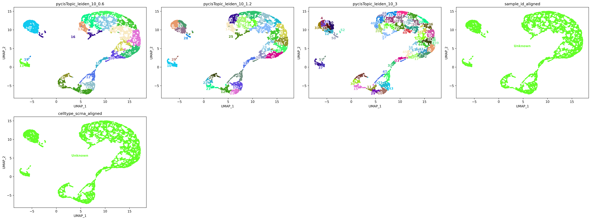

# Multi-omics GRN Construction with SCENIC+  

We are using **multi-omics data for Neurog2** to construct a gene regulatory network (GRN) with **SCENIC+**.  

# Part 1: Analyzing scRNA-seq Data  

Violin plots displaying quality control metrics such as number of genes detected per cell, total counts, and percentage of mitochondrial gene expression.

### Filtering Criteria

Quality control filtering was applied to exclude low-quality cells and potential doublets. Cells were retained only if they met all the following conditions:

- Number of genes detected per cell between **500 and 7000**  
- Total counts per cell between **1000 and 30,000**  
- Percentage of mitochondrial gene counts less than **25%**  

This filtering step ensures removal of dead or dying cells, doublets, and technical artifacts, thereby improving the quality of downstream analyses.

### Additional Analysis Figure

### UMAP and Clusters UMAP

### DOTPLOT 

### Marker Genes UMAP

### Annotations 

# Part 2: Analyzing scATAC Data  

### Clustering 

## Running Pycistopic pre step for Scenic+ 

#### QC 

## Cluctering after add scRNA metadata to ATAC 

