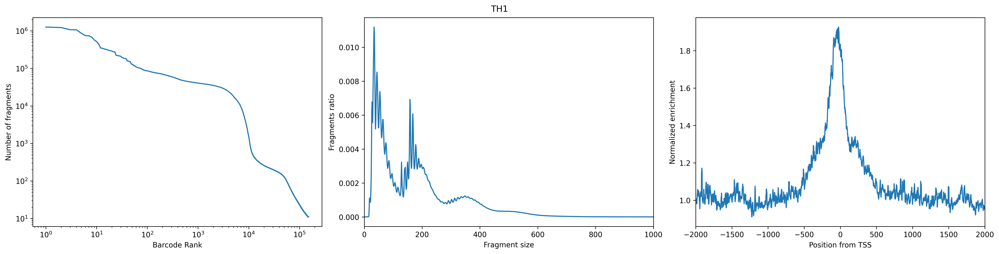
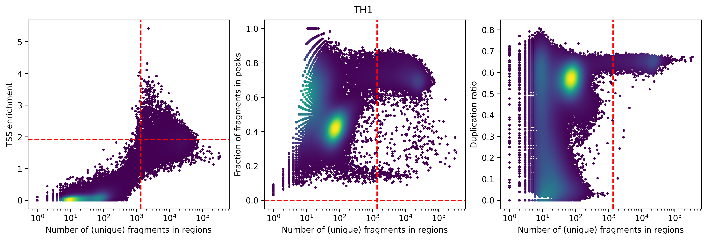
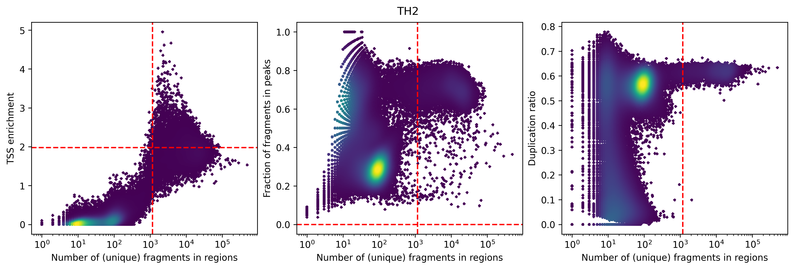

# Multi-omics GRN Construction with SCENIC+  

We are using **multi-omics data for Neurog2** to construct a gene regulatory network (GRN) with **SCENIC+**.  

Absolutely! The main missing piece in your summary is **DAR (Differential Accessible Regions) analysis**, which is an important intermediate step in SCENIC+ between PySciTopic and cisTarget. I’ve rewritten your workflow in full, hierarchical Markdown format, integrating DAR and clarifying inputs/outputs.

---

# SCENIC+ Full Workflow (Hierarchical Steps)

## Step 1: PySciTopic (Topic Modeling for scATAC-seq)

* **Purpose:** Identify latent topics representing co-accessible chromatin regions in single-cell ATAC-seq data.

### 1.a Data preprocessing

* **What it does:** Filter cells and peaks, normalize counts, remove low-quality data.
* **Input:** Raw scATAC-seq count matrix
* **Output:** Filtered and normalized count matrix
* **Required:** ✅ Yes

### 1.b Topic modeling

* **What it does:** Learn topics representing sets of co-accessible peaks.
* **Input:** Filtered scATAC matrix
* **Output:** Topic–cell matrix, topic–peak matrix
* **Required:** ✅ Yes

### 1.c Topic binarization

* **What it does:** Convert continuous topic–peak weights into binary sets of peaks per topic (Otsu thresholding or top-N selection).
* **Input:** Topic–peak matrix
* **Output:** Binarized topic–peak sets
* **Required:** ✅ Yes

---

## Step 2: DAR Analysis (Differential Accessible Regions)

* **Purpose:** Identify peaks that are differentially accessible across cell types or conditions.

### 2.a Differential testing

* **What it does:** Compare peak accessibility between groups of cells (clusters, conditions) to detect DARs.
* **Input:** Filtered scATAC-seq matrix, cell metadata or clusters
* **Output:** List of DARs with statistical significance (logFC, p-value)
* **Required:** ✅ Yes

### 2.b DAR filtering

* **What it does:** Filter significant DARs for downstream motif enrichment and regulon analysis.
* **Input:** List of DARs
* **Output:** High-confidence DAR set per cell type/cluster
* **Required:** ✅ Yes

---

## Step 3: cisTarget (Motif Enrichment / Regulon Inference)

* **Purpose:** Infer transcription factors regulating the DARs or topic-specific peaks.

### 3.a Peak-to-gene mapping

* **What it does:** Assign peaks (or DARs) to nearby genes to connect regulatory regions to potential targets.
* **Input:** Binarized topic–peak sets or DARs, genome annotation
* **Output:** Peak-to-gene associations
* **Required:** ✅ Yes

### 3.b Motif enrichment

* **What it does:** Identify transcription factor motifs enriched in DARs or topic-specific peaks.
* **Input:** Peak-to-gene associations
* **Output:** Candidate TF regulons
* **Required:** ✅ Yes

### 3.c Regulon refinement

* **What it does:** Prune false positives and retain high-confidence TF–target interactions.
* **Input:** Candidate TF regulons
* **Output:** Refined regulons
* **Required:** ✅ Yes

---

## Step 4: SCENIC+ (Regulon Activity & Downstream Analysis)

* **Purpose:** Quantify regulon activity per cell and explore regulatory programs.

### 4.a Regulon activity scoring

* **What it does:** Compute activity of each regulon in each cell (AUCell or similar).
* **Input:** Refined regulons, topic–cell matrix or gene expression matrix
* **Output:** Cell × regulon activity matrix
* **Required:** ✅ Yes

### 4.b Clustering / Dimensionality reduction

* **What it does:** Reduce dimensionality using regulon activity, cluster cells, and visualize cell states.
* **Input:** Cell × regulon activity matrix
* **Output:** UMAP/tSNE plots, cell clusters
* **Required:** ⚪ Optional (visualization)

### 4.c Network visualization

* **What it does:** Build TF–target regulatory network plots.
* **Input:** Refined regulons
* **Output:** Regulatory network graphs
* **Required:** ⚪ Optional

### 4.d Multi-omic integration (optional)

* **What it does:** Combine scRNA-seq and scATAC-seq regulons for more comprehensive regulatory inference.
* **Input:** Regulons, scRNA-seq/scATAC-seq matrices
* **Output:** Integrated regulon activity
* **Required:** ⚪ Optional

---

#  Analyzing scRNA-seq Data  

Violin plots displaying quality control metrics such as number of genes detected per cell, total counts, and percentage of mitochondrial gene expression.

### Filtering Criteria

Quality control filtering was applied to exclude low-quality cells and potential doublets. Cells were retained only if they met all the following conditions:

- Number of genes detected per cell between **500 and 7000**  
- Total counts per cell between **1000 and 30,000**  
- Percentage of mitochondrial gene counts less than **25%**  

This filtering step ensures removal of dead or dying cells, doublets, and technical artifacts, thereby improving the quality of downstream analyses.

### Additional Analysis Figure

### UMAP and Clusters UMAP

### DOTPLOT 

### Marker Genes UMAP

### Annotations 

# Part 2: Analyzing scATAC Data  

### Clustering 

## Running Pycistopic pre step for Scenic+ 

#### QC 

# pycisTopic Clustering in SCENIC+

## 🚨🚨🚨 READ THIS FIRST — BIG WARNING! 🚨🚨🚨

> ⚠️ **IMPORTANT: pycisTopic clusters are NOT the same as Seurat or Signac clusters!** ⚠️  
>
> pycisTopic **does not cluster cells based on gene expression (Seurat)** or **raw accessibility peaks (Signac)**.  
> Instead, it clusters based on **topic modeling** of chromatin accessibility profiles — which capture **regulatory programs** (e.g., co-accessible enhancers), not direct gene activity.
>
> 🧠 So, when comparing pycisTopic clustering to Seurat/Signac clusters, remember:
>
> - ✅ **Same cells**, but  
> - ❌ **Not the same clustering method**  
> - ❌ **Not the same input data**  
> - ✅ **Completely different biological focus**

### ⚙️ How Is pycisTopic Clustering Done?

1. **Input**: scATAC-seq peak-by-cell matrix
2. **Topic Modeling**:
   - Use Latent Dirichlet Allocation (LDA) to discover **topics**
   - Each topic is a set of co-accessible genomic regions
3. **Topic Matrix**:
   - Each cell is represented by a **topic-proportion vector**
4. **Dimensionality Reduction**:
   - UMAP is applied to topic vectors (not raw peaks)
5. **Clustering**:
   - Leiden clustering is run on the topic matrix at different resolutions

> ✅ **pycisTopic clustering does NOT use traditional PCA or LSI clustering.**

> Instead, it groups cells based on their **regulatory landscape**, not just expression.

---

### 🎯 Why Use pycisTopic Clustering?

- Captures **regulatory programs** that may not be visible in gene expression alone
- Useful for annotating cell states based on **enhancer activity** or **TF binding**
- Enables downstream integration with **SCENIC+**, where topics are linked to gene regulatory networks

---

### 📌 Summary

- The pycisTopic clusters are based on **topic modeling**, not expression or raw peak counts.
- Each topic reflects a set of co-accessible genomic regions (potentially linked to transcriptional regulation).
- This clustering provides a **regulatory perspective** on cell identity and state.
- Clustering resolution can be adjusted to explore broad vs. fine-grained patterns.

##  UMAPs

### Panel 1: `scRNA_cell_type`
Using `scRNA_cell_type` as a **benchmark** means:

* ✅ You're using **known transcriptomic identities** (from gene expression data) to **validate or interpret** the **regulatory clusters** generated from ATAC-seq data by pycisTopic.

* ✅ You can assess whether **chromatin accessibility-based clustering** (via topic modeling) is able to **recapitulate known biology**, such as major cell types or subtypes.

* ✅ It helps determine the **biological relevance** and **granularity (resolution)** of the pycisTopic clusters — revealing how well topic modeling captures meaningful regulatory variation across cells.

You can think of it as a **"ground-truth check"**:
If pycisTopic clusters align well with `scRNA_cell_type` labels, it increases confidence that the inferred topics reflect **real biological programs** rather than technical noise.

### Panels 2–4: `pycisTopic_leiden_X_Y`

These panels show **unsupervised clustering** of cells based on their **topic distributions**, as inferred from **pycisTopic**.

Each cell is represented by its unique combination of topics — patterns of co-accessible regulatory regions. pycisTopic then applies **Leiden clustering** to group cells with similar topic profiles.

This clustering reflects the cells’ **regulatory landscapes**, rather than their gene expression, offering insights into cell identity and state from an **epigenomic perspective**.

The panels differ by **resolution**:

* **Panel 2** (resolution = 0.6): Low granularity — broad clusters representing major cell types.
* **Panel 3** (resolution = 1.2): Medium granularity — more refined clusters, possible subtypes.
* **Panel 4** (resolution = 3.0): High granularity — fine-scale clusters, potentially revealing rare or transitional states.

> Increasing the resolution creates more clusters and allows finer distinctions, but may also split biologically similar cells.

These clustering results can be compared to `scRNA_cell_type` labels to evaluate how well the regulatory (ATAC-based) clustering reflects known transcriptomic cell types.

## Annotations  (cluster-level labels)

- After running Leiden clustering on the ATAC data, each cell belongs to a numeric cluster (0, 1, 2, …).  
- Each cell also carries a suggested reference label (from scRNA), either by:
  - **Barcode transfer** (if multiome), or  
  - **Similarity mapping** (if separate scRNA + scATAC).  

### How the cluster annotation is assigned:
1. **Look at all cells in a cluster**  
   - For example, Cluster 3 contains many cells that were individually labeled by the scRNA reference.

2. **Check which label is most common**  
   - If 80% of cells in Cluster 3 are labeled `CellTypeX`, and 20% are mixed (`CellTypeY`, `CellTypeZ`),  
     then the dominant identity is `CellTypeX`.

3. **Assign that label to the entire cluster**  
   - Cluster 3 is renamed from `3` → `CellTypeX(3)`.

### How to read the annotation plot

- Each colored region is still a Leiden cluster from the ATAC UMAP.  
- But instead of numeric IDs, clusters are now labeled with:  
  - **The dominant biological identity** (from scRNA labels).  
  - **The original cluster number** in parentheses for reference.  

➡️ Example:  
- `CellTypeX(3)` = Leiden Cluster 3, annotated as CellTypeX.  
- `CellTypeY(5)` = Leiden Cluster 5, annotated as CellTypeY.

##  🚨🚨🚨 Difference between scRNA mapping and annotation 

### scRNA mapping (`celltype_scrna`)
- **Level:** Per-cell  
- **How:** Each ATAC cell is assigned an scRNA label  
  - Multiome → by shared barcode  
  - Separate datasets → by similarity mapping (e.g., gene activity → scRNA reference)  
- **Result:**  
  - Individual cells show their scRNA identity.  
  - A Leiden cluster may look mixed (e.g., some MG, some Rod, some Cone).  
- **Interpretation:** Fine-grained view of how every single ATAC cell maps to RNA cell types.

---

### Cluster-level annotation (after annotation)
- **Level:** Per-cluster  
- **How:** Each Leiden cluster is renamed based on the **majority scRNA label** of its cells  
  - Example: if 80% of cells in Cluster 2 are MG → Cluster 2 is annotated as `MG(2)`.  
- **Result:**  
  - Each cluster gets one “consensus” label.  
  - Mixed identities inside a cluster are no longer shown.  
- **Interpretation:** Coarse-grained view where clusters are given a single dominant biological identity.

### Binarising Topics 

## Why Binarise Topics?

### The Problem
- A topic distribution is usually **dense** (many peaks with small probabilities).  
- Biologists often want a **clean list of peaks “belonging” to a topic**, not fractional weights.  

### The Solution: Binarisation
- Binarisation converts these continuous weights into a **binary set of topic-specific features (peaks)**:  
  - `1` = peak is *assigned* to this topic  
  - `0` = peak is *not assigned*  

### Benefits
- Run **motif enrichment** (find transcription factors driving a topic).  
- Interpret topics as **regulatory programs**.  
- Compare topics across **different experiments**.  

# Understanding PySciTopic Binarisation Plots

## 1. `cell_topic_li.png`
- **LI = Likelihood Index (or Log-likelihood Index)**  
- Shows how well different numbers of topics explain the data across cells.  
- Used to check **model fit** or to decide if the chosen number of topics makes sense.  

👉 Look for an **elbow point** or plateau, where adding more topics doesn’t improve the fit much.

## 2. `region_bin_otsu.png`
- Uses **Otsu’s method**, an automatic thresholding algorithm (borrowed from image processing).  
- Applied to the **topic–peak weight distribution** to split peaks into “important” vs “background.”  
- Plot shows a **histogram of peak weights** with a red cutoff line chosen by Otsu.  

👉 Interpretation:
- Left of cutoff = background peaks (0)  
- Right of cutoff = binarised peaks (1)  

## 3. `region_bin_top3k.png`
- Selects the **top 3,000 peaks per topic** instead of using Otsu.  
- Plot shows ranked peak weights, with a cutoff line at the 3,000th peak.  

👉 Interpretation:
- Above line = peaks kept  
- Below line = peaks discarded  

## 4. `region_bin_topics_otsu.png`
- Same as `region_bin_otsu.png`, but aggregated **per topic**.  
- Shows how many peaks passed Otsu thresholding in each topic.  

👉 Interpretation:
- Some topics will be **sharp** (few strong peaks).  
- Others will be **broad** (many weaker peaks above cutoff).  

## 5. `region_bin_topics_top_3000.png` / `region_bin_topics_top3k.png`
- Same as above, but for the **top-3k-per-topic method**.  
- Shows how many peaks were selected per topic (usually 3,000, unless a topic has fewer peaks).  

👉 Interpretation:
- Lets you compare **Otsu vs fixed top-N** binarisation strategies.  

## Why These Plots Matter
- **Quality check** → Did binarisation pick a reasonable number of peaks per topic?  
- **Method choice**:
  - *Otsu*: adaptive, good if topics have very different sharpness.  
  - *Top-N*: consistent, good for comparing topics across experiments.  
- **Downstream analysis**: The binarised sets feed into **motif enrichment** and **regulatory program discovery**, so checking these plots ensures binarisation wasn’t too loose or too strict.  

  

###  🚨🚨🚨 Investigating why all MG? 

This is the cell counts in clusters based on barcodes:

| Cluster      | Cell Count |
|--------------|-----------|
| MG           | 3206      |
| BC           | 1298      |
| Rod          | 997       |
| MGPC         | 612       |
| Microglia    | 344       |
| AC           | 103       |
| Cone         | 48        |
| Astrocyte    | 4         |
|**Total cells** | **6612** |
 

and the barplots: 

## Pending Differentially Accessible Regions (DAR) Analysis 

Run differential accessibility analysis (DAR) on the clustered Cistopic object using **`celltype_scrna`** as the grouping variable, with **adjusted p-value threshold = 0.8** and **log2 fold-change threshold = 0.09**.  
Imputation and normalization are scaled by **1e7** and **1e4**, respectively, using **1 CPU** and temporary files stored in `DAR_TMP`.

## References

- [Pycistopic: Human Cerebellum Notebook](https://pycistopic.readthedocs.io/en/latest/notebooks/human_cerebellum.html#Getting-pseudobulk-profiles-from-cell-annotations)
- [SCENIC+: Official Documentation](https://scenicplus.readthedocs.io/en/latest/index.html)

