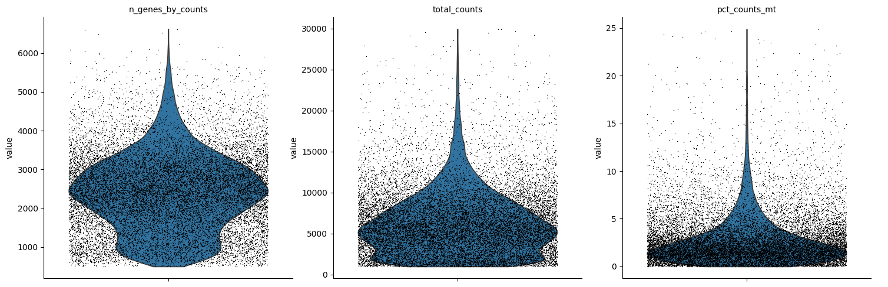

# Multi-omics GRN Construction with SCENIC+  

We are using **multi-omics data for Neurog2** to construct a gene regulatory network (GRN) with **SCENIC+**.  

# Part 1: Analyzing scRNA-seq Data  


Violin plots displaying quality control metrics such as number of genes detected per cell, total counts, and percentage of mitochondrial gene expression.

### Filtering Criteria

Quality control filtering was applied to exclude low-quality cells and potential doublets. Cells were retained only if they met all the following conditions:

- Number of genes detected per cell between **500 and 7000**  
- Total counts per cell between **1000 and 30,000**  
- Percentage of mitochondrial gene counts less than **25%**  

This filtering step ensures removal of dead or dying cells, doublets, and technical artifacts, thereby improving the quality of downstream analyses.


### Additional Analysis Figure


### UMAP and Clusters UMAP


### DOTPLOT 
 

### Marker Genes UMAP


# Part 2: Analyzing scATAC Data  


###Clustering 


## Barcode-to-Cluster Mapping

The following file format (`CSV`) shows how barcodes are mapped to clusters:
After annotation, we can replace the id with the cluster 


## Header of the barcode to cluster mapping 
```csv
"barcode","cluster"
"Control_CGCCTCATCCTAAGGT-1","4"
"Control_CCAGCCTGTTTGGGCG-1","0"
"Control_TTGACTAAGTCATTTC-1","2"
"Control_GACTATTCAAGGTCCT-1","0"
"Control_GCTAGCTCACAGGAAT-1","10"
"Control_AGCATCCCACCATATG-1","0"
"Control_AGGTTAGAGCGATACT-1","11"
"Control_TCTCACCAGCTTCTCA-1","2"
"Control_GGCTCAATCCTAGTTT-1","0"
"Control_TTGCATTTCTCTAGCC-1","10"
"Control_CACCTCAGTGTTTGAG-1","8"
"Control_AGTAGGATCACTCAAA-1","0"
"Control_CCTAAAGGTAAGGTTT-1","4"
"Control_GTGCTTACAGCCAGAA-1","0"
"Control_CTCTTGATCGAGGTGG-1","10"
"Control_CCTACTTCACATTGCA-1","0"
"Control_GCCTACTTCTGTAATG-1","4"
"Control_AATCCGTAGTATCGCG-1","0"
"Control_GTGGATGCAAGACTCC-1","10"

