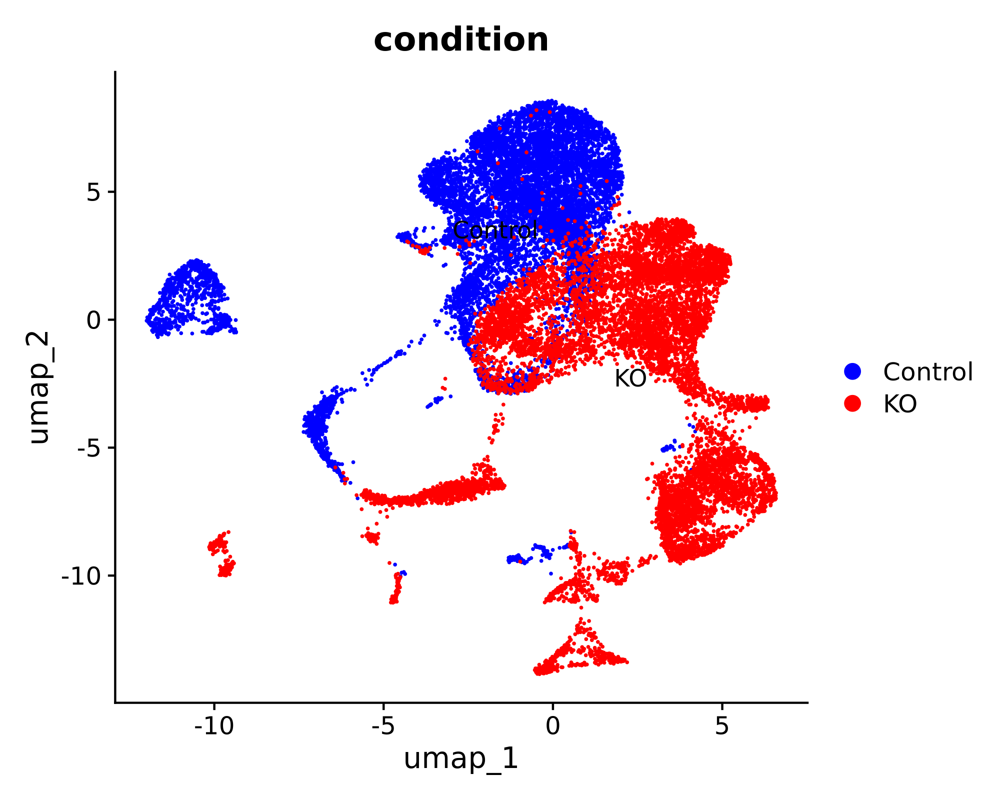
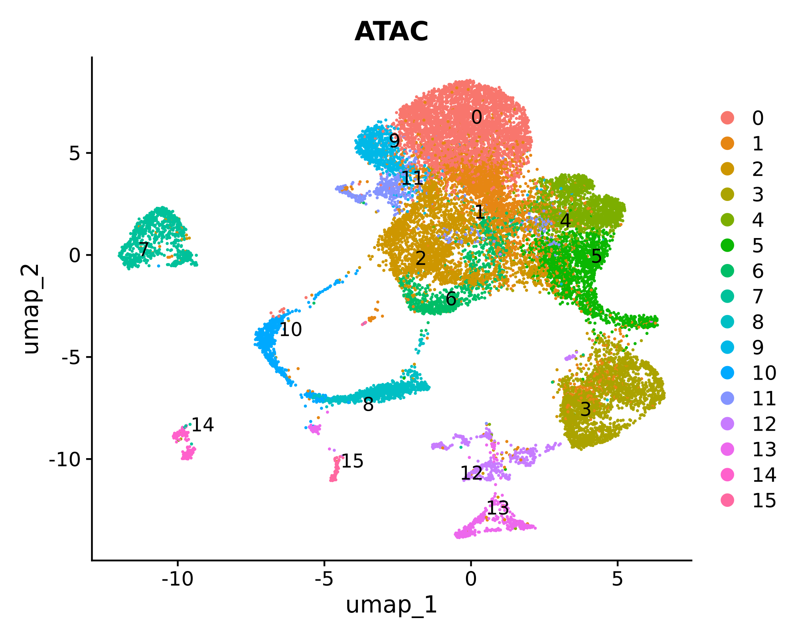
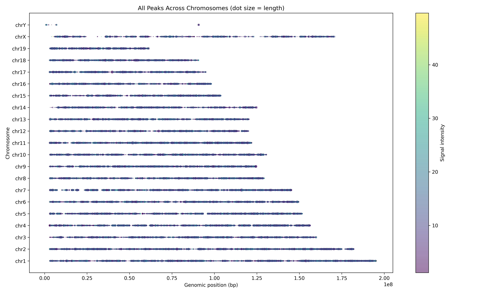

### SCENIC+ Workflow (Major Steps)

1. **Chromatin accessibility modeling (pycisTopic):**  
   - Perform topic modeling on scATAC-seq data to identify cis-regulatory topics (sets of co-accessible regions).

2. **cisTarget database creation:**  
   - Build motif/track databases from candidate regulatory regions.  
   - Databases are used to connect TF motifs with accessible regions.

3. **SCENIC+ analysis:**  
   - Integrate ATAC-seq (regulatory regions) with RNA-seq (gene expression).  
   - Infer TF–target gene regulons using motif enrichment + peak-to-gene links.  
   - Score regulon activity across single cells to characterize cell states.


---
# 🛑 PART A: Preprocessing of scRNA – Clustering and Visualization
---

This step performs **cell-level preprocessing, dimensionality reduction, clustering, and visualization** for single-cell RNA-seq data.  

The goal is to **group similar cells together** based on their gene expression profiles and prepare the data for downstream analyses and interpretation.

1. **Defines cell types or states**
   - Clustering organizes cells based on similarity, providing a clear structure for interpretation.

2. **Supports downstream analyses**
   - Clusters and cell type labels can guide pseudobulk aggregation, marker gene evaluation, or further integrative analyses.

3. **Improves interpretability**
   - Visualization and marker gene plotting help assign biological meaning to clusters, making results easier to understand and communicate.


## Part A Results: scRNA-seq results    


Violin plots displaying quality control metrics such as number of genes detected per cell, total counts, and percentage of mitochondrial gene expression.

### Filtering Criteria

Quality control filtering was applied to exclude low-quality cells and potential doublets. Cells were retained only if they met all the following conditions:

- Number of genes detected per cell between **500 and 7000**
- Total counts per cell between **1000 and 30,000**
- Percentage of mitochondrial gene counts less than **25%**

This filtering step ensures removal of dead or dying cells, doublets, and technical artifacts, thereby improving the quality of downstream analyses.


### Additional Analysis Figure


### UMAP and Clusters UMAP


### DOTPLOT 


### Marker Genes UMAP


### Annotations 


### Cell counts 

This is the cell counts in clusters based on barcodes:

| Cluster      | Cell Count |
|--------------|-----------|
| MG           | 3206      |
| BC           | 1298      |
| Rod          | 997       |
| MGPC         | 612       |
| Microglia    | 344       |
| AC           | 103       |
| Cone         | 48        |
| Astrocyte    | 4         |
|**Total cells** | **6612** |


---
# 🛑 PART B: Pycistopic: preprocessing the ATAC part and integrating metadata from scRNA 
---


## scATAC preanalyis by Seurat as input to pycistopic preprocessing 



### Clustering 



---

# 1. Pseudobulk Export with pycisTopic 


This step **executes the pseudobulk aggregation** using `pycisTopic`.  
- Takes the conceptual idea and TSV intermediates from Step 1 and **produces the actual BED/BigWig files** for downstream analysis.  
- Aggregates reads per **cell type × sample**, generating clean coverage tracks for visualization and peak calling.  

---

## [pycistopic_pseudobulk.py](pycistopic_pseudobulk.py)


1. **Aggregates fragments into pseudobulk TSVs** (if not already created)  
   - Combines all reads for each group into a single table of fragment coordinates.  

3. **Converts TSVs to standard formats**  
   - **BED files:** fragment positions formatted for downstream peak calling (MACS2, etc.).  
   - **BigWig files:** normalized coverage tracks for visualization in genome browsers.  

4. **Organizes outputs**  
   - Saves **TSV reference files** with paths to all BED and BigWig files for downstream pipelines.  

---

> ## Inputs
>
> 1. **Fragment files**: `fragments.tsv.gz` per sample (from the experiment).  
> 2. **Chromosome sizes**: defines genome boundaries (from UCSC or Ensembl).  

---

> ## Outputs
>
> 1. **BED files** – fragment coordinates per pseudobulk (cell type × sample).  
> 2. **BigWig files** – normalized coverage tracks for genome browsers or QC.  
> 3. **TSV lists** – references of all generated BED/BigWig paths.  

---

Step 1 was like **planning and creating the combined raw audio (TSV tables)**.  
Step 2 is where we **mix, normalize, and export it into clean, usable formats (BED/BigWig)** for analysis.  
 
## Pseudobulk output: cell data summary

Total barcodes across all samples: 1156914
-----------------------
Sample distribution:
-----------------------
### 
| Sample   | Barcodes   |
|----------|------------|
| Control  | 584491     |
| KO       | 572423     |

and

```
scenicOuts/
└── consensus_peak_calling
    ├── bed_paths.tsv
    ├── bw_paths.tsv
    ├── pseudobulk_bed_files
    │   ├── Control.fragments.tsv.gz
    │   └── KO.fragments.tsv.gz
    └── pseudobulk_bw_files
        ├── Control.bw
        └── KO.bw
```


# 2. Peak Calling Step with MACS2

This step identifies **peaks**, i.e., genomic regions that are significantly enriched for ATAC-seq fragments.  

- Pseudobulk files summarize the signal for each **cell type × sample**.  
- MACS2 uses these aggregated fragment coordinates to detect regions with **high accessibility**, likely representing regulatory elements such as enhancers or promoters.  
- The output peaks are later used to generate **consensus peaks** and for topic modeling in pycisTopic.

---

> ## Inputs
>
> 1. **Pseudobulk BED files** from the previous step  
>    - Contain aggregated fragment coordinates per cell type × sample.  
>
> 2. **Genome size** (e.g., `mm` for mouse)  
>    - Required for MACS2 to estimate background signal and calculate statistical significance.  

---

> ## Outputs
>
> 1. **Peak files (`.narrowPeak`)**  
>    - Lists genomic regions with significantly enriched ATAC fragments per pseudobulk.  
>
> 2. **BED files of peaks (optional)**  
>    - Can be used for merging into consensus peaks across samples.  
>
> 3. **Auxiliary MACS2 files**  
>    - Statistics and logs for quality control (e.g., peak scores, fragment pileups).  

---

## [run_macs2](`run_macs2.py`)

1. **Convert fragment files to BED format**  
   - Ensures compatibility with MACS2 (chromosome, start, end).  

2. **Call peaks using MACS2**  
   - Scans the genome to find regions with **more fragments than expected by chance**.  
   - Parameters like `--shift` and `--extsize` adjust fragment positioning to capture accessible regions accurately.  
   - Each pseudobulk sample is processed independently.  

3. **Store peak files**  
   - Produces a BED-like file of called peaks for each pseudobulk.


Think of the pseudobulk BED as a **heat map of open windows across the city**.  
- MACS2 finds **clusters of “hot spots”** where many windows are open at once — these are your peaks.  
- Each peak represents a genomic region with strong evidence of accessibility in that cell type.


### Density plot for KO and Controol narrowPeaks 

  


# 3. Consensus Peak Generation Step


After pseudobulk aggregation and MACS2 peak calling, each sample (or cell type × sample) has its **own set of peaks**.  
- Different samples may have slightly different peaks because of biological variability or sequencing depth.  
- To do comparative analyses across samples or feed data into pycisTopic, we need **one unified set of peaks** — the **consensus peak set**.  

Think of it as **finding all regions that are open in at least one sample and merging overlapping regions into a master list**.

- Ensures **all samples/cell types are analyzed on the same set of genomic regions**, which is critical for:
  - Accurate topic modeling (pycisTopic LDA)
  - Differential accessibility analysis
  - Integration with scRNA-seq metadata
---

## What does it do?

1. **Collect all individual MACS2 peaks**  
   - Each pseudobulk BED file from Step 2 has peaks called separately using MACS2.  

2. **Combine all peak files**  
   - Concatenate all peak files into one large table.  

3. **Sort and merge overlapping peaks**  
   - Using tools like **bedtools sort** and **bedtools merge**.  
   - If two peaks from different samples overlap, they are merged into a single peak region.  
   - The result is a **non-redundant, genome-wide consensus peak set**.

---

> ## Inputs
>
> 1. **MACS2 peak files** (`*.narrowPeak` or BED)  
>    - Generated per sample/pseudobulk in the previous MACS2 step.  
>
> 2. **Optional parameters** (if any) for merging, e.g., minimum overlap or padding.  

---

> ## Outputs
>
> 1. **Consensus peaks BED file**  
>    - One unified list of all peak regions across samples.  
>    - This file is later used to define **features/regions in pycisTopic objects**.  
>
> 2. **Intermediate combined BED** (optional)  
>    - The unsorted concatenated peaks before merging.  


---

Imagine several people drawing maps of the same city, each highlighting where the windows are open.  
- Each map may differ slightly.  
- The consensus peak step **merges all maps into one master map** that shows all open windows observed across everyone.  


---


# 4. TSS Generation Step in pycisTopic

This step generates a **BED file containing the transcription start sites (TSSs)** of genes for the reference genome.  

- TSS regions are important for **quality control**, such as checking **TSS enrichment** in ATAC-seq data.  
- It can also be used to **annotate peaks** with nearby genes for downstream analyses.  

1. **Extract TSS positions from gene annotations**
   - For each gene, determine the **chromosome, strand, and start position** corresponding to the TSS.

2. **Convert to BED format**
   - Each TSS is represented as a genomic interval suitable for downstream QC or annotation.

3. **Save TSS BED file**
   - The BED file can be used for **TSS enrichment analysis** or annotating peaks to genes.

- This step **does not directly depend on the pseudobulk or MACS2 peaks**.
- It **uses the reference genome annotation**, so it is independent of previous sample-specific steps.
- The generated TSS BED file is primarily used for **quality control** (e.g., checking enrichment of ATAC signal at TSSs) and for **peak annotation downstream**.


---

> ## Inputs
>
> 1. **Reference genome annotation**  
>    - Provided by pycisTopic via Ensembl gene annotations (e.g., `"mmusculus_gene_ensembl"`).  
>    - Contains gene coordinates, including TSS positions.  
>
> 2. **Genome build specification**  
>    - UCSC or Ensembl genome coordinates (e.g., `"mm10"` for mouse).  
>
> ---
>
> ## Outputs
>
> 1. **TSS BED file**  
>    - Contains genomic coordinates of all transcription start sites for the reference genome.  
>    - Example path: `outs/qc/tss_mm10.bed`.  


# 5. QC check and plots 


### TH1
- Barcode QC  
  

- General QC  
  

### TH2
- Barcode QC  
  

- General QC  
  


### QC Barcodes Summary

#### File Information
- **File**: `qc_barcodes_thresholds.pkl`
- **Status**: ✅ **VALID** - Ready for CistopicObject creation

#### Sample Overview

| Sample | Cells Passing QC | Unique Fragments Threshold | TSS Enrichment Threshold | FRIP Threshold |
|--------|------------------|----------------------------|--------------------------|----------------|
| **TH1** | ~200 cells | 1,354 | 1.72 | 0 |
| **TH2** | ~200 cells | 1,174 | 1.87 | 0 |

#### Data Structure
```python
{
    'barcodes': {
        'TH1': array([~200 cell barcodes]),
        'TH2': array([~200 cell barcodes])
    },
    'thresholds': {
        'TH1': {
            'unique_fragments_threshold': 1353.92,
            'tss_enrichment_threshold': 1.72,
            'frip_threshold': 0
        },
        'TH2': {
            'unique_fragments_threshold': 1174.01,
            'tss_enrichment_threshold': 1.87,
            'frip_threshold': 0
        }
    }
}
```

# 6. Creating Cistopic Objects Step

This step creates a **cistopic object**, which is the central data structure used by pycisTopic for **topic modeling of chromatin accessibility**.  

- The cistopic object organizes **fragment data, peak regions, and QC information** in a way suitable for downstream analyses.  
- It is essentially a **single-cell peak-by-cell matrix** stored in a Python pickle file, with metadata attached.  

1. **Load fragments and QC metadata**
   - Filter cells based on QC thresholds.

2. **Map fragments to consensus peaks**
   - Assign each fragment from a cell to a peak, creating a **peak-by-cell matrix**.

3. **Remove blacklisted regions**
   - Exclude problematic regions that may generate false positives.

4. **Store in cistopic object**
   - Includes:
     - Cell-by-peak matrix
     - Cell metadata (sample, cell type, QC info)
     - Peak metadata (genomic coordinates, annotation)

5. **Save as Python pickle**
   - This object will be used for **topic modeling, clustering, and downstream analysis**.

---

## Connection to Previous Steps

- **Takes consensus peaks** (from merged MACS2 outputs).
- **Uses fragment files** (from preprocessing/pseudobulk).
- **Incorporates QC information** (filtered cells, TSS enrichment, etc.).

- This step is **critical** because it transforms raw and pseudobulk fragment data into a structured object suitable for all downstream pycisTopic analyses.

---

> ## Inputs
>
> 1. **Fragments dictionary (`fragments_dict.pkl`)**  
>    - Maps each sample name to its fragment file (`.tsv.gz`).  
>    - Produced or referenced from earlier steps (preprocess/pseudobulk fragment info).  
>
> 2. **QC results (`qc_barcodes_thresholds.pkl`)**  
>    - Information about filtered/high-quality cells, such as thresholds for minimum fragments, TSS enrichment, etc.  
>    - Derived from QC steps performed earlier.  
>
> 3. **Consensus peaks BED file**  
>    - Generated in the **previous consensus peak step**.  
>    - Defines the genomic regions (peaks) that will form the rows of the cell-by-peak matrix.  
>
> 4. **Blacklist BED file (`mm10-blacklist.v2.bed`)**  
>    - Contains regions of the genome known to produce artefactual signals, which are excluded.  
>
> 5. **QC output directory**  
>    - Provides additional QC-related files for integration.  
>
> 6. **Number of CPUs (`n_cpu`)**  
>    - Used for parallel processing.  
>
> ---
>
> ## Outputs
>
> 1. **Cistopic object (`cistopic_objects_mm10.pkl`)**  
>    - Single Python object storing the filtered peak-by-cell matrix and associated metadata.  
>    - Ready for running **topic modeling (LDA)** and other analyses in pycisTopic.  


# CistopicObject Analysis Summary

## 📁 File Information
- **File**: `cistopic_objects_mm10.pkl`
- **Status**: ✅ **VALID** - Ready for SCENIC+ workflow
- **Size**: 244,060.45 KB
- **Structure**: List of 2 CistopicObjects

## 🧫 Sample Overview

| Sample | Cells | Regions | Project Name | Fragment File |
|--------|-------|---------|--------------|---------------|
| **TH1** | 294 cells | 163,474 regions | `TH1` | `TH1_atac_fragments.tsv.gz` |
| **TH2** | 258 cells | 163,375 regions | `TH2` | `TH2_atac_fragments.tsv.gz` |

## 📊 Data Structure

### Cell Data (per sample)
- **Shape**: 294 × 23 (TH1), 258 × 23 (TH2)
- **Key Columns**: 
  - `cisTopic_nr_frag` - Total fragments per cell
  - `cisTopic_log_nr_frag` - Log-transformed fragment count
  - `cisTopic_nr_acc` - Accessible regions per cell
  - `sample_id` - Sample identifier
- **Barcode Format**: `{CELL_BARCODE}-{SAMPLE_ID}` (e.g., `ATCACAATCACAGGAA-1-TH1`)

### Region Data (per sample)
- **Shape**: ~163,000 × 8
- **Genomic Format**: `chr{number}:{start}-{end}`
- **Key Columns**: 
  - `Chromosome`, `Start`, `End`, `Width`
  - `cisTopic_nr_frag` - Fragment count per region
  - `cisTopic_nr_acc` - Cell accessibility per region

## ✅ Quality Assessment
- **✓ Cell Recovery**: Good cell counts (294 + 258 = 552 total cells)
- **✓ Region Consistency**: Similar number of regions between samples
- **✓ Data Integrity**: All expected metadata columns present
- **✓ Format Compliance**: Proper barcode and region naming conventions

**Status**: ✅ **READY FOR DOWNSTREAM ANALYSIS**

# 7. Merging Cistopic Objects Step


This step merges **one or more cistopic objects** into a single unified object.  

- In workflows with multiple samples, batches, or preprocessing runs, each cistopic object may represent a separate sample or subset of cells.  
- Merging combines them into a **single cistopic object**, making downstream analyses (topic modeling, clustering, DAR analysis) easier and consistent across all cells.  

1. **Load all input cistopic objects**
   - One object per sample or batch.

2. **Combine peak matrices**
   - Align peaks across objects to ensure **consistent genomic coordinates**.

3. **Merge cell metadata**
   - Keep track of **cell type, sample, QC info** for all cells.

4. **Create unified cistopic object**
   - Contains all cells and peaks in a single structure.

5. **Save merged object**
   - Stored as a Python pickle for use in downstream pycisTopic steps.

- **Takes individual cistopic objects** generated in the `create_cistopic_objects.py` step.
- Aligns and merges them so that **all samples/cells are in one unified object** for downstream pycisTopic analysis.

---
> ## Inputs
>
> 1. **Cistopic object(s) (`cistopic_objects_mm10.pkl`)**  
>    - Created in the previous step.  
>    - Contains:  
>      - Peak-by-cell matrices  
>      - Cell metadata (cell type, sample, QC info)  
>      - Peak metadata  
>
> 2. **Output path (`merged_cistopic.pkl`)**  
>    - Where the merged cistopic object will be saved.  
>
> ---
>
> ## Outputs
>
> 1. **Merged cistopic object (`merged_cistopic.pkl`)**  
>    - Single object containing all cells and peaks.  
>    - Ready for:  
>      - LDA/topic modeling  
>      - Clustering  
>      - Differential accessibility analysis  

1. **Load all input cistopic objects**  
   - One object per sample or batch.  

2. **Combine peak matrices**  
   - Align peaks across objects to ensure **consistent genomic coordinates**.  

3. **Merge cell metadata**  
   - Keep track of **cell type, sample, QC info** for all cells.  

4. **Create unified cistopic object**  
   - Contains all cells and peaks in a single structure.  

5. **Save merged object**  
   - Stored as a Python pickle for use in downstream pycisTopic steps.

---

## Merged CistopicObject Summary

### 📊 Dataset Overview
- **Project**: TH1_TH2_merged
- **Total Cells**: 552 (294 TH1 + 258 TH2)
- **Total Regions**: 164,065
- **File Size**: 226,875.51 KB

### 🧫 Sample Integration
- **Fragments**: Both TH1 and TH2 fragment files integrated
- **Cell Data**: All 552 cells with complete QC metrics (23 columns)
- **Region Data**: Unified genomic regions from both samples


# 8. Adding scRNA-seq Metadata to Cistopic Objects

This step integrates **scRNA-seq-derived metadata** into the merged cistopic object.  

- Single-cell RNA-seq preprocessing (clustering, cell type annotation) provides **cell type labels, sample IDs, or other metadata**.  
- Attaching this information to the cistopic object allows **linking chromatin accessibility topics to known cell types** for interpretation.  

1. **Load merged cistopic object**
   - Contains all ATAC-seq cells in a single structure.

2. **Load scRNA metadata**
   - Map cell barcodes to those in the cistopic object.

3. **Attach metadata to cistopic object**
   - Adds new columns in the cell metadata (obs) of the cistopic object.
   - This allows **annotating cells with known cell types or clusters** derived from scRNA-seq.

4. **Save updated cistopic object**
   - The new object contains both chromatin accessibility data and scRNA-derived annotations.

- **Takes the merged cistopic object** from the previous merging step.
- **Takes metadata from scRNA preprocessing**, including clusters and cell type labels.
- **Purpose:** Link ATAC-seq profiles to known cell types for biological interpretation and downstream analyses.


---

> ## Inputs
>
> 1. **Merged cistopic object (`merged_cistopic.pkl`)**  
>    - Created in the previous merge step.  
>    - Contains the **ATAC-seq peak-by-cell matrix** and ATAC metadata.  
>
> 2. **scRNA-seq metadata CSV (`scRNA_barcodes.csv`)**  
>    - Contains cell barcodes and associated information such as:  
>      - Cell type labels  
>      - Sample ID  
>      - Cluster assignments  
>
> 3. **Output pickle path (`merged_with_meta.pkl`)**  
>    - Where the updated cistopic object with metadata will be saved.  
>
> ---
>
> ## Outputs
>
> 1. **Cistopic object with scRNA metadata (`merged_with_meta.pkl`)**  
>    - Each cell now has ATAC-seq data **and** associated scRNA-seq-derived labels.  
>    - Enables cell type–specific analyses in topic modeling, DAR identification, and visualization.  
> 
> ---


# 9. Topic Modeling with Mallet (run_mallet.py)

This step performs **Latent Dirichlet Allocation (LDA) topic modeling** on the chromatin accessibility data stored in the cistopic object.  

- Each **topic represents a set of genomic regions (peaks) that tend to be accessible together** across cells.  
- Topic modeling reduces the high-dimensional peak-by-cell matrix into a **smaller number of interpretable patterns**, capturing regulatory programs or cell type–specific accessibility.  
- Mallet is a high-performance Java-based LDA implementation used here to efficiently handle large single-cell ATAC datasets.  

1. **Cistopic object with topic models**
   - Contains updated metadata:
     - Each cell’s topic proportions
     - Each topic’s peak composition

2. **Mallet model files**
   - Intermediate files for each topic and iteration
   - Useful for diagnostics or rerunning analyses

3. **Saved directories** (`MALLET/`)
   - Organizes all output for downstream steps, including LDA visualization and DAR analysis.

- **Takes the annotated cistopic object** from `add_scrna_metadata.py`
- Uses the **peak-by-cell matrix** (from consensus peaks) and **cell metadata** (from scRNA annotations)
- This is the core analytical step where the **high-dimensional ATAC-seq data is reduced into interpretable topics**, which will be used in clustering, DAR analysis, and visualization.

### 🧬 Mallet Example for Biologists


Source : Blei, D.M., 2012. Probabilistic topic models. Commun. ACM 55(4)


### In GRN context 


### 🧩 What is a GRN Module?

In the context of gene regulatory networks (GRNs), a **module** is:

> A group of **genes and/or regulatory regions (peaks)** that are **co-regulated**, meaning they tend to be active together in the same cells.  
> Modules often correspond to the set of genes controlled by the same transcription factor or regulatory program.  

Modules help simplify complex GRNs by grouping together genes with coordinated activity, making it easier to understand regulatory patterns in single-cell data.

| NLP Concept      | GRN Concept (SCENIC+) | What Mallet counts            | What LDA classifies             |
| ---------------- | --------------------- | ----------------------------- | ------------------------------- |
| Document         | Cell                  | Word occurrences per document | Topics in document              |
| Word             | Gene / Peak           | Frequency in document / cell  | Module membership               |
| Topic            | Module                | Co-occurring words/features   | Which genes/peaks form a module |
| Topic proportion | Module activity       | Counts in documents/cells     | Strength of module per cell     |


> ## Inputs
>
> 1. **Annotated cistopic object (`merged_with_meta.pkl`)**
>    - Contains:
>      - Peak-by-cell matrix (from previous steps)
>      - scRNA-seq metadata for each cell (cell type, cluster, sample)
>
> 2. **Mallet software path**
>    - The executable used to run LDA.
>
> 3. **Topic modeling parameters**
>    - `n_topics`: number of topics to infer (e.g., 15, 20, 25, 30)
>    - `n_iter`: number of iterations for the LDA algorithm
>    - `alpha` / `eta`: Dirichlet priors controlling sparsity and topic distribution
>    - `random_state`: ensures reproducibility
>
> 4. **Computational settings**
>    - `n_cpu`: number of CPUs for parallel processing
>    - `mallet_memory`: memory allocated for Mallet
>    - Temporary and save directories (`tmp_path`, `save_path`)
>
> ## Outputs
>
> 1. **Cistopic object with topic models**
>    - Contains updated metadata:
>      - Each cell’s topic proportions
>      - Each topic’s peak composition
>
> 2. **Mallet model files**
>    - Intermediate files for each topic and iteration
>    - Useful for diagnostics or rerunning analyses
>
> 3. **Saved directories** (`MALLET/`)
>    - Organizes all output for downstream steps, including LDA visualization and DAR analysis.

--- 
# 10. Adding LDA Model to Cistopic Object


This step integrates the **topic modeling results generated by Mallet** back into the cistopic object.  

- After running Mallet, the topic assignments and distributions are stored in external files.  
- To continue downstream pycisTopic analyses (clustering, DAR, visualization), the **cistopic object must include the LDA model results** internally.  

1. **Load the cistopic object and Mallet outputs**
   - Reads the topic distributions for cells and peak compositions per topic.

2. **Attach LDA results to the cistopic object**
   - For each cell: stores **topic proportions**.
   - For each topic: stores **peak weights / peak-to-topic assignment**.

3. **Save the updated cistopic object**
   - The object is now fully ready for:
     - Clustering based on topics
     - Differential accessibility analysis (DAR)
     - Visualization (UMAP, heatmaps, dotplots)

- **Takes the cistopic object with merged cells and scRNA metadata**.
- **Uses the topic modeling results generated by Mallet** in the previous step.
- Prepares the object for **all downstream analyses in pycisTopic**, making it the “complete” cistopic object.


# 🧬 LDA in SCENIC+ (after Mallet)

**Input from Mallet:** A count matrix of genes/peaks per cell: each row = a cell, each column = a gene/peak, each entry = how often that gene/peak occurs (or is active) in that cell.

## Step 1: Initialize Modules (Topics)
LDA assumes that each cell is a mixture of modules (like a mixture of topics in NLP). It randomly assigns each gene/peak in each cell to a tentative module.  
Example:  
Cell 1: [GeneA, GeneB, GeneC, Peak1, Peak2] → [Module 0, Module 1, Module 0, Module 0, Module 1]  
Cell 2: [GeneD, GeneE, GeneC, Peak2, Peak3] → [Module 1, Module 1, Module 0, Module 1, Module 0]  
At this point, module assignments are just random guesses.

## Step 2: Iterative Update (Gibbs Sampling)
LDA repeatedly updates the assignment of each gene/peak to a module based on: 1) which modules are common in this cell (cell-level distribution) and 2) which modules usually contain this gene/peak across all cells (feature-level distribution). The algorithm uses probabilistic rules to favor assignments that explain the observed co-occurrences better. Intuition: Genes/peaks that tend to appear together across multiple cells gradually get grouped into the same module.

## Step 3: Define Modules
After many iterations, LDA converges. Each module is defined by a set of genes/peaks that co-occur across cells. These are the regulatory modules: groups of co-regulated genes/peaks.  
Example:  
Module 0: GeneA, GeneC, Peak1  
Module 1: GeneB, GeneD, GeneE, Peak2, Peak3

## Step 4: Module Activity per Cell
LDA calculates, for each cell, how strongly each module is represented:  
| Cell  | Module 0 | Module 1 |  
|-------|----------|----------|  
| 1     | 0.6      | 0.4      |  
| 2     | 0.4      | 0.6      |  
| 3     | 0.7      | 0.3      |  
This tells us which modules are active in each cell, analogous to topic proportions in NLP.

## ✅ Summary
Goal of LDA in SCENIC+: Discover hidden regulatory structure in single-cell data.  
Input: Mallet counts of genes/peaks per cell.  
Output: 1) Modules = groups of co-occurring/co-regulated genes/peaks, 2) Module activity per cell = how strongly each module is present in each cell. LDA is essentially finding hidden patterns of co-regulation from the raw co-occurrence data prepared by Mallet.

---

> ## Inputs
>
> 1. **Cistopic object with Mallet outputs (`MALLET/merged_cistopic_with_models.pkl`)**  
>    - Contains:  
>      - Peak-by-cell matrix  
>      - Cell metadata (including scRNA annotations)  
>      - Placeholder for LDA topics  
>
> 2. **Output path (`outs/`)**  
>    - Where the updated cistopic object with the integrated LDA model will be saved.  
>
> ---
>
> ## Outputs
>
> 1. **Cistopic object with integrated LDA model (`cistopic_LDA_obj.pkl`)**  
>    - Each cell has topic proportions.  
>    - Each topic has peak weights.  
>    - Contains all previous metadata (scRNA annotations, QC info).  
>
> ---


# 11. Clustering Cistopic Objects and UMAP Visualization

This step performs **dimensionality reduction and clustering** of cells based on their **topic profiles**.  

- Each cell now has a **topic proportion vector** from the previous LDA step.  
- Clustering identifies groups of cells with similar chromatin accessibility patterns.  
- UMAP is used to **visualize the cells in 2D space** for exploratory analysis and interpretation.  

1. **Dimensionality reduction**
   - Computes a **cell-cell similarity graph** using the topic proportions.

2. **Leiden clustering**
   - Assigns cells into discrete clusters based on graph topology.
   - Multiple resolutions allow exploring different cluster granularities.

3. **UMAP embedding**
   - Projects high-dimensional topic profiles into 2D for visualization.
   - Each cell is positioned in 2D such that similar cells are close together.

4. **Save results**
   - Updates the cistopic object with **cluster assignments**.
   - Saves UMAP coordinates and plots for exploration.

- **Takes the cistopic object with integrated LDA model** (topic distributions per cell).
- **Uses topic proportions** to construct a similarity graph for clustering.
- Prepares the object for **differential accessibility analysis, visualization, and interpretation**.


---
> ## Inputs
>
> 1. **Cistopic object (`cistopic_obj_cleaned2.pkl`)**  
>    - Contains:  
>      - Peak-by-cell matrix  
>      - Cell metadata (including scRNA-seq annotations)  
>      - LDA topic distributions per cell  
>
> 2. **Clustering parameters**  
>    - `resolutions`: controls granularity of Leiden clustering (e.g., 0.6, 1.2, 3)  
>    - `k`: number of neighbors used for graph construction  
>
> 3. **Output directories**  
>    - Where UMAP plots and the clustered object will be saved.  
>
> ---
>
> ## Outputs
>
> 1. **Clustered cistopic object (`cistopic_obj_clustered.pkl`)**  
>    - Each cell has:  
>      - Topic proportions  
>      - Cluster assignment(s) at different resolutions  
>      - Original metadata (scRNA annotations, QC info)  
>
> 2. **UMAP plots**  
>    - Visualizes cell clusters and optionally sample or cell type labels.  
>
> 3. **UMAP coordinates and graph data**  
>    - Stored in the object for downstream analyses.  
>
> ---

### Clustering output 

#### Cell level annotations
 


#### Cluster level annotations 


#### Quick look to cell ratios in pycistopic 


# 12. Binarizing Topics Step

This step **converts continuous topic distributions into binary accessibility matrices** for downstream analysis, such as differential accessibility testing (DAR).  

- Each cell has **topic proportions** from the LDA step.  
- Binarization transforms these proportions into **presence/absence calls**, e.g., a peak is considered "active" in a cell if its topic proportion passes a threshold.  
- This simplifies downstream analyses and makes them more robust to noise.

1. **Load clustered cistopic object**
   - Access topic proportions for each cell.

2. **Binarize topics**
   - Convert continuous topic weights into binary values (0/1) for each peak in each cell.
   - Thresholding ensures that only **high-confidence topic-peak associations** are considered active.

3. **Update cistopic object**
   - Replaces or adds a **binarized peak-by-cell matrix** to the object.

4. **Save results**
   - The binarized cistopic object is ready for **differential accessibility (DAR) analysis** and downstream analyses.

- **Takes the clustered cistopic object** with topic proportions from the previous clustering step.
- Converts continuous LDA results into a **binary format** suitable for DAR analysis.
- Prepares the object for **robust differential accessibility testing** and other downstream applications.


---

> ## Inputs
>
> 1. **Clustered cistopic object (`cistopic_obj_clustered.pkl`)**  
>    - Contains:  
>      - Peak-by-cell matrix  
>      - LDA topic proportions per cell  
>      - Cluster assignments from the previous step  
>
> 2. **Output directory (`outs/topics`)**  
>    - Where the binarized cistopic object and related files will be saved.  
>
> ----
>
> ## Outputs
>
> 1. **Binarized cistopic object (`cistopic_obj_binarized.pkl`)**  
>    - Contains binary peak-by-cell matrix alongside all previous metadata (topic assignments, clusters, scRNA annotations).  
>
> 2. **Optional summary files**  
>    - Can include per-topic peak statistics or binarization thresholds.  
>
> ---

---

#### Binarisations output 


# 12.  Differential Accessibility (DAR) Analysis Step


This step identifies **differentially accessible regions (DARs)** between groups of cells, such as cell types or clusters.  

- Uses the **binarized cistopic object** from the previous step.  
- Tests which peaks are significantly more accessible in one group of cells versus others.  
- Results can reveal **cell type–specific regulatory regions** or other biologically meaningful patterns.  

1. **Load the binarized cistopic object**
   - Access the binary peak-by-cell matrix and cell metadata.

2. **Group cells by the specified variable**
   - Example: group cells by `celltype_scrna`.

3. **Compute differential accessibility**
   - For each peak, compare accessibility across groups.
   - Use statistical tests and thresholds (adj. p-value, log2 fold-change) to identify significant DARs.

4. **Store results**
   - Annotates the cistopic object with DAR information.
   - Saves tables of significant DARs for each comparison.

- **Takes the binarized cistopic object** from the previous binarization step.
- Uses **cell type or cluster metadata** (from scRNA integration or clustering).
- Generates **peak-level annotations** identifying regions differentially accessible between groups.

---

> ## Inputs
>
> 1. **Binarized cistopic object (`cistopic_obj_binarized.pkl`)**  
>    - Contains:  
>      - Binary peak-by-cell matrix  
>      - Cell metadata (clusters, scRNA annotations, topic assignments)  
>
> 2. **Grouping variable (`-v celltype_scrna`)**  
>    - Specifies which cell metadata column to use for group comparisons (e.g., cell type labels from scRNA-seq).  
>
> 3. **Analysis parameters**  
>    - `n_cpu`: number of CPUs for parallel computation  
>    - `temp_dir`: temporary files storage  
>    - `scale_impute` / `scale_norm`: scaling factors for normalization  
>    - `adjpval_thr`: adjusted p-value threshold for significance  
>    - `log2fc_thr`: log2 fold-change threshold for significance  
>
> 4. **Output directory (`outs/DAR_results`)**  
>    - Where DAR results and updated cistopic objects will be saved.  
>
> ---
>
> ## Outputs
>
> 1. **Cistopic object with DAR annotations (`cistopic_obj_with_DARs.pkl`)**  
>    - Each peak is annotated with significance values, fold changes, and group-specific activity.  
>
> 2. **DAR result tables**  
>    - Lists of peaks that are differentially accessible per group.  
>
> 3. **Optional plots or summaries**  
>    - Can visualize DARs by cluster, cell type, or topic.  
>
> ---


#### DAR preliminary results


# 14. Exporting Region Sets from DAR Results

This step exports **lists of genomic regions (peaks) identified as DARs** into separate files for downstream analyses or external tools.  

- Takes the **cistopic object annotated with DAR results** from the previous step.  
- Generates **BED or other standard formats** representing differentially accessible regions per group or cell type.  
- These exported region sets can be used for:
  - Motif enrichment analysis  
  - Gene set enrichment analysis  
  - Visualization in genome browsers  


1. **Load the DAR-annotated cistopic object**
   - Access peaks and their associated DAR information.

2. **Select peaks per group or significance criteria**
   - Example: peaks with adjusted p-value below threshold and log2 fold-change above threshold.

3. **Export to BED or other standard formats**
   - One file per group or condition.
   - Includes genomic coordinates and optionally additional metadata.

4. **Save files in output directory**
   - Ready for downstream analyses or sharing with other tools.

- **Takes the DAR-annotated cistopic object** from `dar_analysis.py`.
- Uses **peak-level differential accessibility information** to generate region sets.
- Prepares results for **external analyses or downstream biological interpretation**.


---

> ## Inputs
>
> 1. **Cistopic object with DAR annotations (`cistopic_obj_with_DARs.pkl`)**  
>    - Contains:  
>      - Binary peak-by-cell matrix  
>      - Cell metadata  
>      - DAR results for each peak (p-values, fold-changes, significant groups)  
>
> 2. **Output directory (`outs/`)**  
>    - Where the exported region sets will be saved.  
>
> ---
>
> ## Outputs
>
> 1. **Region set files (BED)**  
>    - Lists of DARs per group, including genomic coordinates.  
>    - Can be used for motif enrichment, visualization, or pathway analyses.  
>
> 2. **Optional summary tables**  
>    - Summarize number of DARs per group or comparison.  
>
> ---

---
# 🛑 PART C:  cisTarget Databases for Motif Enrichment (Optional Step) 
---

This step involves **using cisTarget databases** for motif and regulatory network analysis downstream of pycisTopic.  

- cisTarget databases link **genomic regions (peaks) to transcription factor motifs** and candidate target genes.  
- They are required for **motif enrichment analysis, regulatory network inference, and linking DARs to TF activity**.  
- **Creating custom cisTarget databases is optional**, but can be done if you want to analyze a specific genome, species, or motif collection.  
- For speed and convenience, we will **rely on prebuilt databases** in this workflow.


## Prebuilt Databases

For mouse (`mm10`) or human (`hg38`), prebuilt cisTarget databases typically include:

1. **Motif rankings (`.feather` files)**  
   - Genome-wide ranking of regions for each transcription factor motif.  
   - Example: `"mm10-500bp-upstream-7species.mc9nr.feather"`  

2. **Motif annotations (`.motifs.tbl`)**  
   - Information about the motifs, including TF name, family, and source database.  

3. **Gene annotations**  
   - Links between regions and nearby genes, allowing assignment of TF motifs to target genes.  

- These prebuilt files allow **rapid motif enrichment analysis** without having to scan the entire genome manually.

---

## Role in Workflow

- cisTarget databases are used **after DARs or topic regions are identified**.  
- They allow pycisTopic to perform:

  1. **Motif enrichment analysis**  
     - Determine which TF motifs are overrepresented in DARs or topic-specific peaks.  
  2. **Regulatory network inference**  
     - Identify candidate TFs controlling cell type–specific chromatin accessibility.  

- Without these databases, the downstream steps (cisTarget enrichment) cannot run efficiently.  

---

## Using Prebuilt vs Custom Databases

- **Prebuilt databases (recommended):**  
  - Saves time, standardized, widely used, compatible with pycisTopic.  
- **Custom databases (optional):**  
  - Can be created if you need specific motifs, a custom genome build, or updated annotations.  
  - Takes longer but provides maximum flexibility.


🚨🚨 **Note:** ===> I skipped this part and relied on prebuilt databases for speed 🚀

---
# 🛑 PART D: Running Scenic+ workflow step 
---

- The Snakemake workflow runs the SCENIC+ pipeline on your processed ATAC (and optional scRNA) data.  
- Its main goal is to **infer gene regulatory networks (GRNs)** and compute **TF activity scores per cell**.

SCENIC+ builds on the outputs of **pycistopic** and **cistarget** to generate gene regulatory networks (GRNs).


> **Inputs**  
>  
> - **From pycistopic**  
>   - Cell states / clusters  
>   - Accessible chromatin regions (peaks)  
>  
> - **From cistarget**  
>   - Candidate regulatory regions linked to transcription factor (TF) motifs or ChIP-seq tracks  

----

> **Outputs**  
>  
> 1. **Gene Regulatory Network (GRN)**  
>    - TFs linked to predicted target genes  
>    - Derived from DARs/topics and motif enrichment  
>  
> 2. **TF Activity Matrices**  
>    - Quantitative scores of TF activity per cell  
>  
> 3. **Regulatory Modules**  
>    - Groups of genes predicted to be co-regulated by each TF  
>  
> 4. **Plots and Visualizations**  
>    - Heatmaps of TF activity  
>    - Network diagrams of GRNs  
>    - Motif enrichment summaries  

----

### What SCENIC+ does
SCENIC+ integrates these results to build and score regulatory networks:

**Link regions to genes**  
   - Connects accessible regions to nearby or correlated genes.  

**Combine TF–region and region–gene links**  
   - Builds TF → region → gene connections.  

**Score network activity per cell**  
   - Identifies which regulatory programs are active in different cell states.  

In details: 

1. **Prepare Input Matrices**
   - Extract peak-by-cell matrices or topic-specific binarized data from the cistopic object.  
   - Include cell metadata (clusters, cell types, scRNA info if available).  

2. **Motif Enrichment Using cisTarget**
   - For each DAR or topic-specific peak, identify enriched transcription factor motifs using prebuilt or custom cisTarget databases.  

3. **Regulatory Network Inference**
   - Combine motif enrichment with co-accessibility patterns (and optional scRNA co-expression) to link TFs to their predicted target genes.  
   - Construct a **gene regulatory network (GRN)**, identifying TF-gene relationships.  

4. **TF Activity Scoring**
   - Compute TF activity per cell based on accessibility of target peaks in the GRN.  
   - Produces a cell-by-TF activity matrix that can be used for clustering, visualization, or downstream analysis.  

5. **Visualization and Module Generation**
   - Generate regulatory modules: groups of co-regulated genes per TF.  
   - Create heatmaps, network diagrams, and motif enrichment plots for interpretation.

---

✅ **Summary:**  
- **Purpose:** Infer gene regulatory networks and quantify TF activity per cell.  
- **Inputs:** Processed cistopic object (topics/DARs), cisTarget databases, optional scRNA metadata.  
- **Outputs:** GRN, TF activity matrices, regulatory modules, and visualizations.

## Part D results: scenic+

### Motif Enrichment in SCENIC+

#### 1. Where do the motif enrichment results come from?

The motif enrichment results ([`dem_results.html`](Snakemake/workflow/dem_results.html)) and `dem_results.hdf5` are generated from the **ATAC-seq modality**:

- Peaks/DARs are identified from ATAC (cisTopic + DAR analysis).
- SCENIC+ then tests for **differential motif enrichment (DEM)** in those regions.
- This step checks whether certain TF motifs are significantly enriched in accessible regions linked to specific topics, clusters, or conditions.

➡️ In short: **DEM is ATAC-driven**, but the motifs are mapped back to transcription factors (TFs).

---

#### 2. Why are motif enrichment results needed downstream?

The overall goal of SCENIC+ is to reconstruct **gene regulatory networks (GRNs)** that are supported by both chromatin accessibility and gene expression.  
The motif enrichment layer plays several critical roles:

- **TF prioritization**  
  - Many peaks can map to multiple TFs.  
  - Motif enrichment highlights which TFs are most likely active in a given state.

- **Connecting ATAC to GEX**  
  - Later steps integrate motif enrichment (from ATAC) with co-expression (from RNA).  
  - This is how SCENIC+ builds *regulons* (TF → target gene sets).

- **Filtering false positives**  
  - Expression correlations alone can give spurious TF–gene links.  
  - Motif support ensures that inferred connections have chromatin evidence.

- **Interpreting biology**  
  - Differential motif activity per topic/cluster helps explain which TFs are driving specific cell states.

---

✅ The **DEM results act as a bridge** between ATAC and RNA modalities.  
They make sure that downstream TF–target links are not just statistically correlated, but also **biologically plausible**.

🚨🚨🚨🚨🚨 
##### SNAKEMAKE is still running, more rules are under execution and in the way 


## References

- [Pycistopic: Human Cerebellum Notebook](https://pycistopic.readthedocs.io/en/latest/notebooks/human_cerebellum.html#Getting-pseudobulk-profiles-from-cell-annotations)
- [SCENIC+: Official Documentation](https://scenicplus.readthedocs.io/en/latest/index.html)


